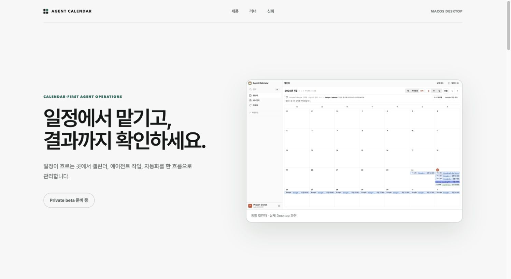
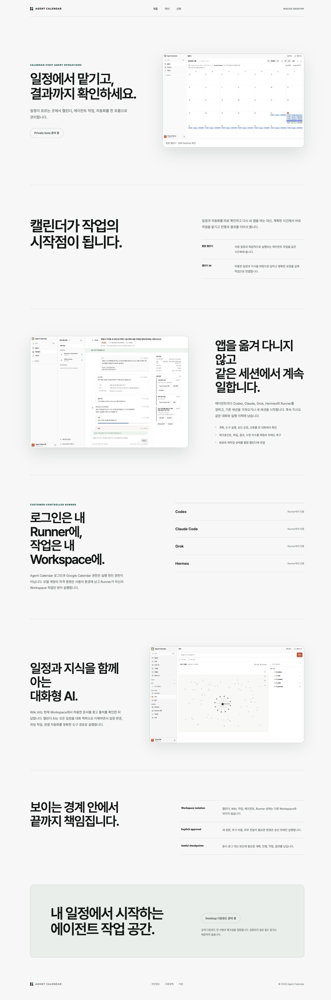
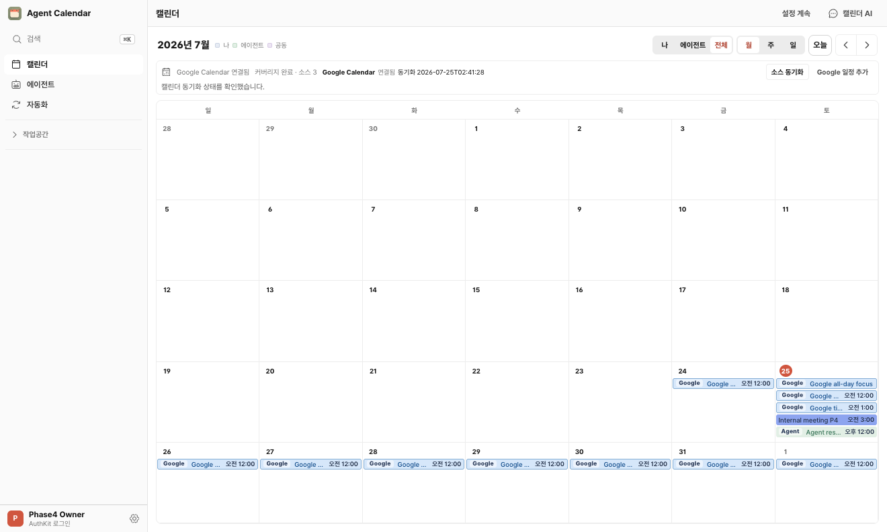
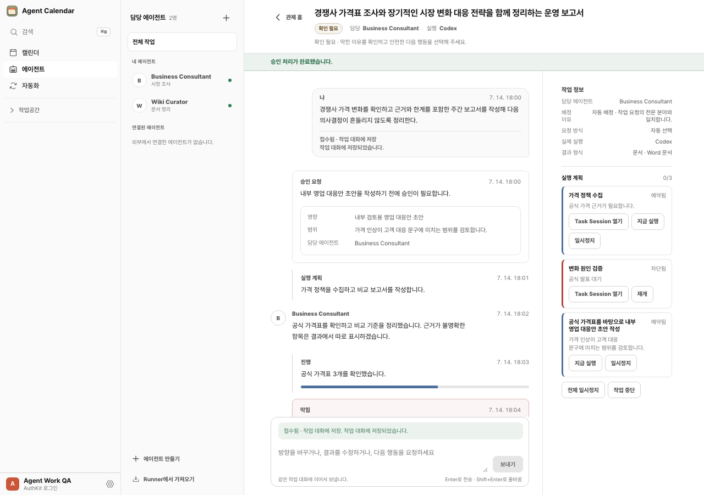
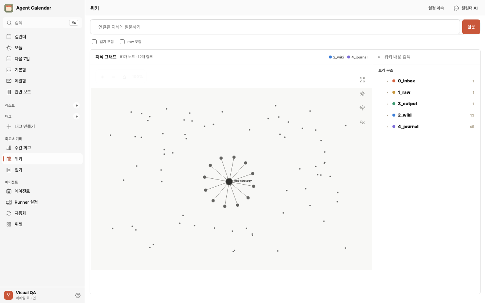
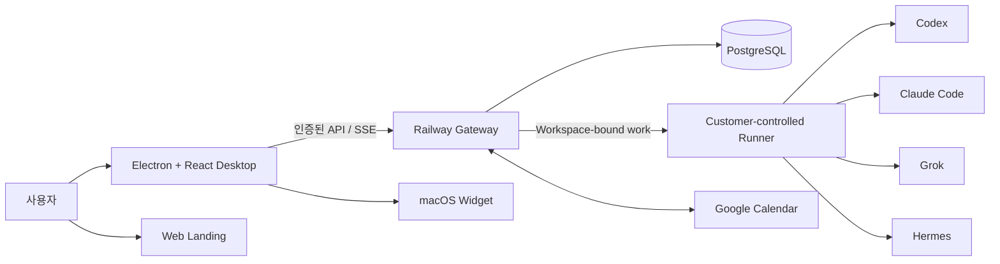

<div align="center">
  

  # Agent Calendar

  **일정에서 일을 맡기고, 진행을 통제하고, 결과까지 확인하는 Calendar-first Agent Operations 제품**

  사람의 일정, 에이전트 작업, 자동화를 하나의 시간축에 연결하는 macOS 데스크톱 앱입니다.

  [랜딩 페이지 보기](#랜딩-페이지) · [제품 화면](#제품-화면) · [아키텍처](#아키텍처) · [로컬 실행](#로컬에서-확인하기)
</div>

> **현재 단계 — Private beta**  
> 저장소와 구현은 공개되어 있지만, 서명·공증·체크섬 검증이 끝나지 않은 Desktop 빌드는 배포하지 않습니다.

## 랜딩 페이지

[랜딩 페이지 소스](apps/web/app/page.tsx) · [Web 앱 구조와 실행법](apps/web/README.md)



랜딩 페이지는 별도 목업이 아니라 실제 Desktop 캡처를 사용해 제품의 세 가지 핵심 흐름을 설명합니다. 저장소에 등록된 공개 호스팅 URL이 아직 없으므로, 확인되지 않은 라이브 주소 대신 아래의 재현 가능한 로컬 실행 방법을 제공합니다.

<details>
<summary><strong>전체 랜딩 페이지 캡처 보기</strong></summary>
<br />

</details>

## 왜 만들었나

AI 에이전트에게 일을 맡긴 뒤에는 대개 채팅 앱, 캘린더, 문서, 자동화 도구를 오가며 진행 상황과 결과를 다시 맞춰야 합니다. Agent Calendar는 이 단절을 **시간**과 **책임**이라는 두 축으로 정리합니다.

- **시간:** 외부 일정과 독립적으로 실행되는 에이전트 작업을 한 캘린더에서 봅니다.
- **책임:** 각 위임 작업에는 담당 에이전트, 실행 계획, 승인 요청, 체크포인트, 결과가 남습니다.
- **통제:** 새 권한, 추가 비용, 외부 전달처럼 영향이 큰 작업은 명시적 승인 뒤에만 진행합니다.
- **소유권:** 실행 엔진의 자격 증명은 사용자 환경의 Runner에 남고, Workspace 간 작업과 데이터는 분리합니다.

## 제품 화면

### 1. 통합 캘린더

Google Calendar 일정, 사용자 일정, 에이전트 작업을 같은 월간 시간축에서 구분해 보여줍니다. 사람의 일정과 독립 실행 작업은 서로 겹칠 수 있다는 도메인 규칙을 UI에도 그대로 반영했습니다.



### 2. 에이전트 작업 관제 공간

하나의 위임 작업 안에서 요청, 실행 계획, 진행, 승인 관문, 막힘, 결과, 후속 지시가 같은 Work Conversation으로 이어집니다. 실행 엔진의 원시 로그보다 사용자가 판단해야 하는 체크포인트를 우선합니다.



### 3. Workspace 지식과 Wiki AI

허용된 문서를 검색하고, 지식 그래프와 출처를 바탕으로 답하는 Knowledge 영역입니다. Calendar AI가 일정과 지식을 대화 맥락으로 사용하되 각 도메인의 원본 데이터를 대신 소유하지 않도록 경계를 나눴습니다.



## 핵심 기능

| 영역 | 구현 내용 |
| --- | --- |
| Unified Calendar | Google Calendar 동기화, 사용자/에이전트/공용 일정 필터, 일정 CRUD |
| Agent Work | 위임 작업 생성, 담당 에이전트 선택, 계획·체크포인트·결과, 중단·재개·수정 차수 |
| Calendar AI | 허용된 일정과 지식을 활용한 대화, 명시적 요청을 도메인 작업으로 라우팅 |
| Knowledge | Wiki 문서 검색, RAG 응답, 출처, 지식 그래프, Workspace 범위 암호화 |
| Runner | 고객 소유 실행 호스트 등록, Workspace 바인딩, Codex·Claude Code·Grok·Hermes 어댑터 |
| Automation | 외부 자동화의 일정·상태 투영, 변경 정책과 승인 관문 |
| Desktop | Electron 보안 브리지, 로그인 세션, deep link, 자동 업데이트, macOS Widget 연동 |

## 아키텍처



Desktop 내부는 `App composition → feature surface → pure domain rules` 방향을 유지합니다. Backend는 인증된 `WorkspaceScope`를 모든 제품 요청의 경계로 사용하고, Runner는 등록된 단 하나의 Workspace에서 받은 작업만 실행하도록 분리했습니다.

### 모노레포 구성

```text
apps/
├── desktop/   Electron + React + TypeScript 데스크톱 클라이언트
├── backend/   Railway gateway, 도메인 서비스, PostgreSQL migrations
├── runner/    사용자 환경에서 실행되는 엔진/자동화 연결 daemon
├── web/       실제 제품 화면을 사용하는 공개 랜딩 페이지
└── widget/    macOS WidgetKit 연동
docs/
├── adr/       인증·배포·보안 등 중요한 기술 결정
├── plans/     plan-first 구현 계획과 acceptance gate
└── operations/운영·복구·릴리스 검증 문서
```

## 기술적 설계 포인트

### Responsible Agent와 Execution Engine을 분리

사용자가 결과에 대해 책임을 묻는 대상은 **담당 에이전트**이고, Codex나 Claude Code 같은 엔진은 실행 수단입니다. 이 구분을 UI, API, persisted data에 유지해 런타임 교체가 작업의 책임 기록을 덮어쓰지 않게 했습니다.

### Workspace isolation을 기본값으로

인증, API, DB, Runner 등록 모두 Workspace 범위를 요구합니다. PostgreSQL migration과 서비스 계층 양쪽에서 소유권을 확인하고, 다른 Workspace의 Runner나 일정이 선택되지 않도록 경계를 둡니다.

### 실행 증거는 남기고 자격 증명은 남기지 않기

Runner가 사용자 환경에서 엔진 계정에 로그인하고 실행합니다. 중앙 서비스에는 실행 상태와 결과 증거를 전달하되, provider 자격 증명을 Agent Calendar 계정 자격 증명으로 취급하지 않습니다.

### 승인 관문은 영향에 비례

모든 동작을 확인받는 대신 새 권한, 추가 비용, 외부 전달처럼 결과를 되돌리기 어려운 작업에 승인 관문을 둡니다. 지원하지 않는 외부 동작은 승인 버튼으로 우회하지 않고 blocked 상태와 이유를 남깁니다.

## 기술 스택

| Surface | Stack |
| --- | --- |
| Desktop | Electron 43, React 18, TypeScript, Vite |
| Backend | Node.js 22, CommonJS gateway/services, PostgreSQL |
| Runner | Node.js daemon, engine/provider adapter architecture |
| Web | React 19, Next.js-compatible routes, vinext, Cloudflare runtime |
| Widget | Swift, SwiftUI, WidgetKit |
| Auth & integrations | WorkOS AuthKit, Google Calendar OAuth/API, Telegram |
| Quality | Node test runner, Playwright, TypeScript typecheck, release/rollback rehearsals |

## 로컬에서 확인하기

### 랜딩 페이지만 빠르게 보기

Node.js `22.x`가 필요합니다.

```bash
npm ci --prefix apps/web
npm --prefix apps/web run dev
```

출력된 로컬 주소를 열면 이 README에 캡처된 실제 랜딩 페이지를 확인할 수 있습니다.

### Desktop 개발 모드

```bash
npm ci
npm run electron:dev
```

Backend 인증과 외부 연동을 함께 확인하려면 WorkOS, PostgreSQL, Google OAuth 등 해당 환경 변수가 별도로 필요합니다. 비밀 값은 저장소에 포함하지 않습니다.

## 검증

변경 범위마다 좁은 검증부터 실행하고, 배포 경계에서는 양쪽 surface와 실제 UI 흐름을 함께 확인합니다.

```bash
npm run backend:check
npm run test:backend
npm run typecheck
npm --workspace apps/desktop run test
npm run test:runner
npm run build:web
npm run test:web
```

Desktop UI 흐름은 `apps/desktop/tests/`의 Playwright 시나리오로, 보안·Workspace·릴리스 경계는 Backend와 Runner의 계약 테스트 및 rehearsal 도구로 검증합니다.

## 프로젝트 문서

- [도메인 언어와 제품 개념](CONTEXT.md)
- [Bounded Context와 Desktop 의존성 방향](CONTEXT-MAP.md)
- [아키텍처 결정 기록](docs/adr)
- [구현 계획과 검증 이력](docs/plans)
- [운영 및 복구 문서](docs/operations)

---

<div align="center">
  <strong>Calendar-first agent operations.</strong><br />
  일정이 흐르는 곳에서 맡기고, 통제하고, 결과까지 확인합니다.
</div>
