<div align="center">
  

  # Agent Calendar

  **나를 이해하고, 기억하며, 필요한 일을 실제로 수행하는 캘린더**

  일정, 메일, 파일과 기록을 이해해 오늘 중요한 일을 알려주고,<br />
  에이전트 작업과 결과를 같은 맥락으로 이어가는 macOS 데스크톱 앱입니다.

  [왜 만들었나](#왜-만들었나) · [처음 사용자 경험](#처음-사용자-경험) · [제품 화면](#제품-화면) · [핵심 기능](#핵심-기능) · [아키텍처](#아키텍처)
</div>

> **현재 단계: Private beta**<br />
> 사용자 이해, Calendar AI, 에이전트 작업과 LLM Wiki가 하나의 캘린더 흐름으로 이어지는
> 첫 사용자 경험을 구현하고 실제 Railway·서명된 Desktop·사용자 소유 Runner 환경에서 검증하고 있습니다.

## 제품 한눈에 보기

Agent Calendar의 중심은 캘린더입니다. Second Brain, LLM Wiki, 에이전트와 자동화는 별도
도구가 아니라 캘린더가 사용자를 이해하고 일을 이어가기 위한 능력입니다.

```text
기록 연결 → 사용자 이해 → 캘린더에서 파악 → Calendar AI와 계획
    ↑                                             ↓
    └──────── Wiki에 기억 ← 결과 보고 ← 에이전트 작업 ────────┘
```

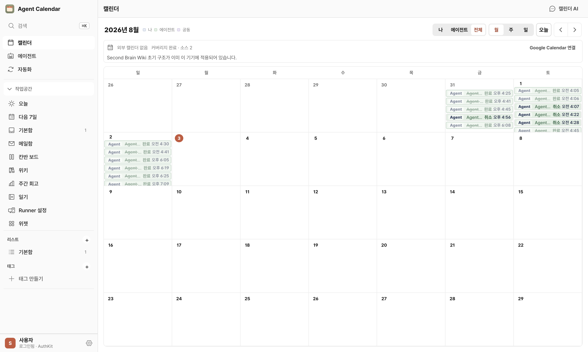

## 왜 만들었나

AI를 자주 쓰는 1인 운영자의 일정, 메일, 파일, 메모, 녹음과 AI 대화는 여러 도구에
흩어져 있습니다. 새로운 AI를 열 때마다 자신과 프로젝트의 배경을 다시 설명하고, AI가
만든 결과와 후속 작업도 사람이 직접 기억해야 합니다.

Agent Calendar는 이 반복을 **이해, 시간, 실행, 기억**이라는 하나의 캘린더 흐름으로
연결합니다.

- **이해:** 허용한 기록에서 사람, 프로젝트, 목표, 선호와 진행 중인 일을 파악합니다.
- **기억:** 원본과 출처를 보존하고 Calendar AI와 LLM Wiki가 다음 대화와 작업에 사용합니다.
- **계획:** 오늘 중요한 일정, 열린 일과 다음 행동을 캘린더에서 알려줍니다.
- **작업:** 배경을 다시 설명하지 않고 조사, 정리, 문서 작성 같은 일을 맡깁니다.
- **보고:** 진행, 막힘, 전체 결과와 산출물이 작업 대화, 캘린더와 Wiki에 돌아옵니다.
- **통제:** 외부 전송, 구매, 삭제, 새 권한과 반복 실행은 사용자 승인 뒤에만 진행합니다.

## 처음 사용자 경험

처음 로그인한 사용자가 빈 화면에서 기능을 찾아다니게 하지 않습니다.

1. 사용자가 캘린더, 메일, 파일 또는 폴더 등 사용할 원본과 범위를 직접 선택합니다.
2. Agent Calendar가 선택된 기록의 출처를 보존하면서 사람, 프로젝트, 목표, 선호와 열린 일을 정리합니다.
3. 완성된 프로필이 아니라 사용자가 검토하고 수정할 수 있는 **Second Brain 초안**을 보여줍니다.
4. 확인된 맥락을 바탕으로 통합 캘린더, Calendar AI와 LLM Wiki의 첫 화면을 구성합니다.
5. Calendar AI가 오늘 중요한 일과 다음 행동을 설명하고, 사용자의 요청을 일정·작업·Wiki 기록으로 이어갑니다.

자동 생성된 이해는 숨겨진 프로필이 아닙니다. 모든 기억은 원본 출처 또는 사용자 확인과
연결되고, 사용자가 수정하거나 제외하고 삭제할 수 있어야 합니다.

## 제품 화면

아래 화면은 로컬 웹 서버나 목업이 아니라 로그인된 패키지 Electron 앱이 Railway production
gateway에 연결된 상태에서 직접 캡처했습니다. 계정 이름, Workspace 이메일, Runner 식별자와
개인 일기 내용만 공개용 캡처에서 가렸습니다. 캡처 환경과 파일 해시는
[manifest](docs/product/surfaces/manifest.json)에서 확인할 수 있습니다.

### 1. 캘린더

Google Calendar 일정, 사용자 일정, 열린 일, 자동화와 독립적으로 실행되는 에이전트 작업을
같은 시간축에서 보여줍니다. 사람의 일정과 에이전트 작업은 서로 다른 시간 자원을 사용하므로
겹쳐도 충돌로 처리하지 않습니다.


### 2. 에이전트

Codex나 Claude처럼 하나의 작업 대화에서 요청, 계획, 의미 있는 진행, 승인, 막힘, 전체 결과와
후속 지시를 이어갑니다. 폴더 없는 리서치·문서 작업과 사용자가 명시적으로 연결한 로컬 폴더
작업을 모두 지원하며, 중단·재시도·병렬 실행·재접속 복구를 제품 흐름 안에서 다룹니다.

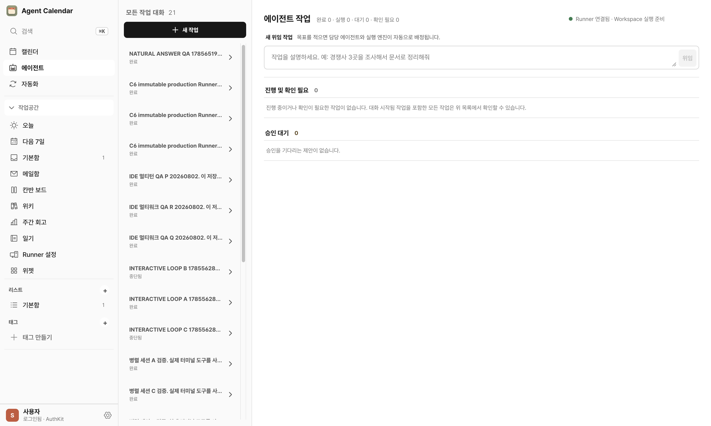

### 3. 자동화

사용자 소유 Runner에서 실행되는 자동화 소스를 연결하고, 가져온 자동화의 일정, 상태와 실행
영수증을 확인합니다. 새 권한이나 외부 전달이 추가되는 변경은 승인 정책을 거칩니다.

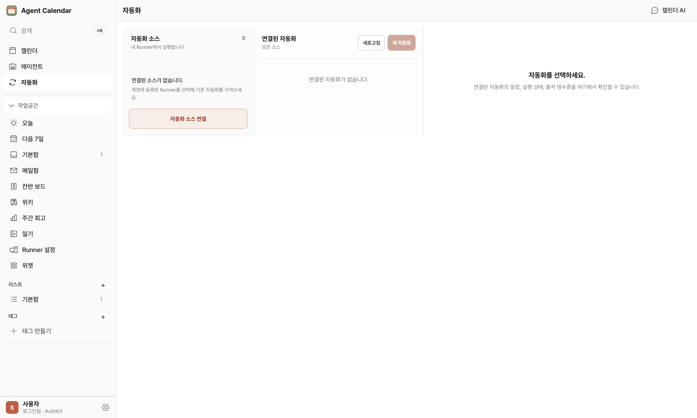

### 4. 오늘

오늘 할 일, 지연된 작업, 검토할 에이전트 결과를 한 화면에서 정리합니다. Calendar AI가
사용자의 일정과 열린 일을 바탕으로 지금 확인해야 할 항목을 설명하는 출발점입니다.

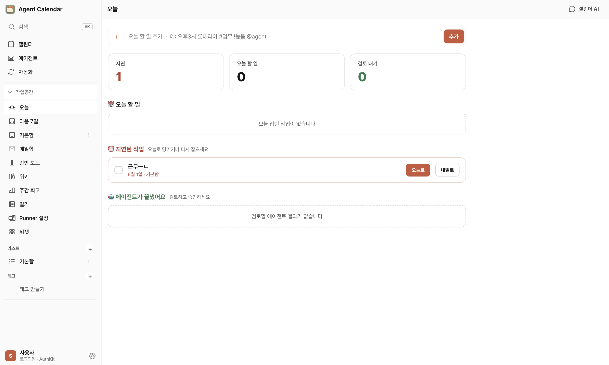

### 5. 다음 7일

이번 주와 다음 주의 작업을 시간순으로 보고, 매일·매주·매월·평일 반복 템플릿으로 빠르게
루틴을 추가합니다. 선택한 작업의 세부 정보는 같은 화면 오른쪽에서 확인합니다.

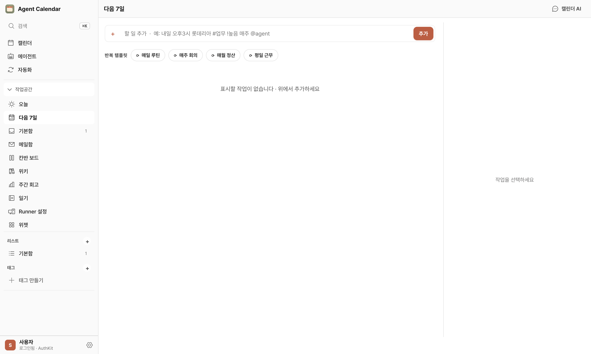

### 6. 기본함

아직 프로젝트나 리스트로 분류하지 않은 작업을 모으고 날짜, 반복, 메모와 하위 작업을
편집합니다. 캘린더나 메일에서 빠르게 만든 열린 일이 사라지지 않도록 받는 곳입니다.

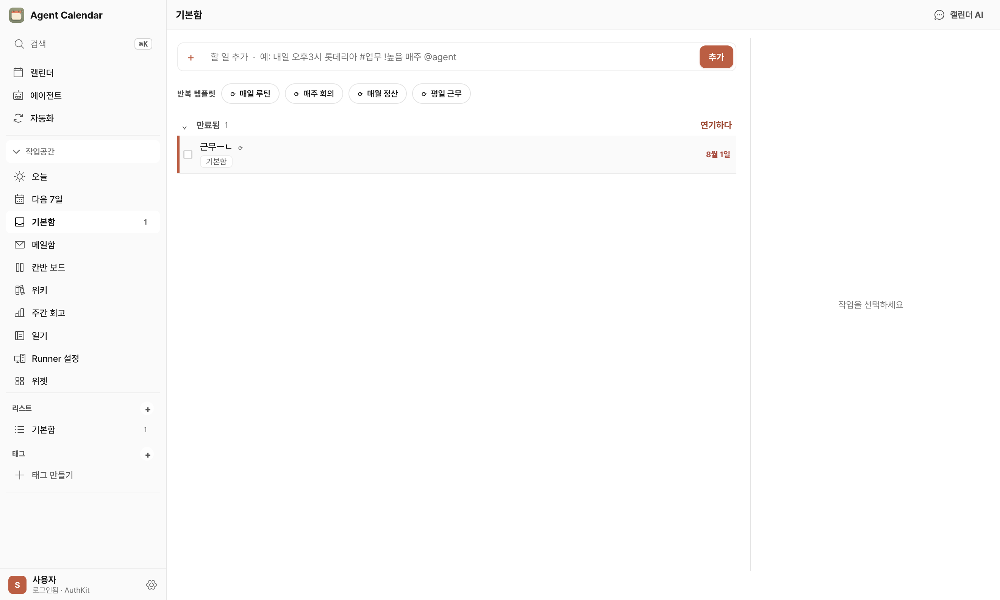

### 7. 메일함

사용자가 별도로 허용한 Gmail 읽기 전용 권한으로 받은편지함을 연결합니다. 메일을 읽고
필요한 내용을 작업이나 에이전트 요청으로 이어가며, 전송·삭제 권한은 요청하지 않습니다.

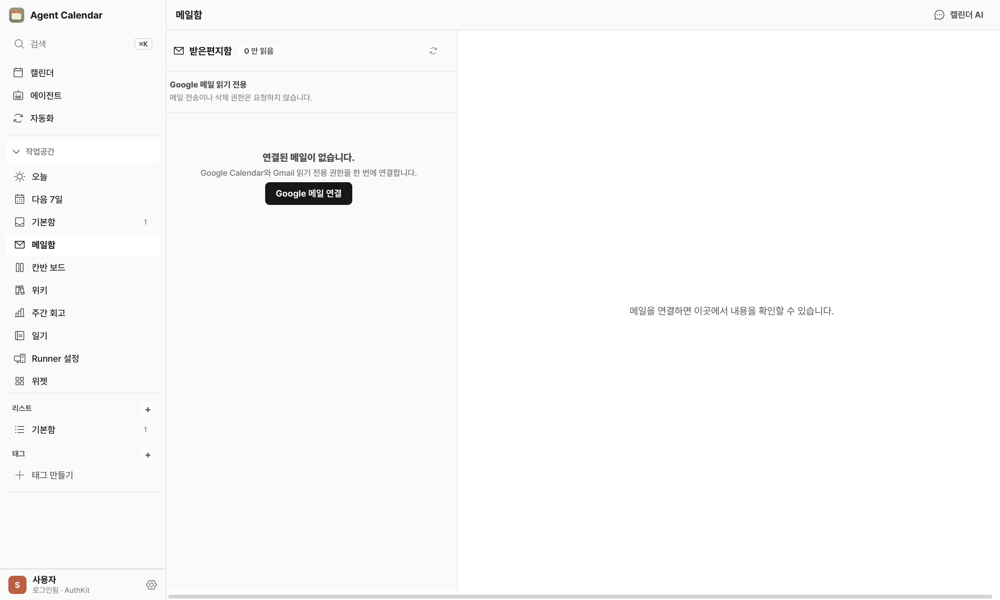

### 8. 칸반 보드

기본, 진행 중, 검토, 완료 단계로 작업을 배치해 상태를 한눈에 확인합니다. 캘린더의 시간축과
같은 작업 원본을 사용하므로 보드와 일정이 별도 데이터로 갈라지지 않습니다.

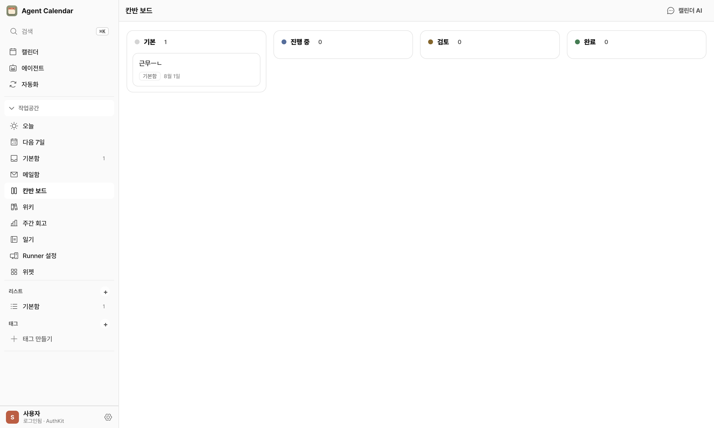

### 9. 위키

파일, 일정, 메일, 메모, 녹음, 작업 대화와 결과의 원본을 보존하고 사람, 프로젝트, 결정,
아이디어와 다음 행동을 연결합니다. Calendar AI와 에이전트는 현재 허용된 기록만 사용하며,
사용자는 답의 출처와 기억된 맥락을 직접 확인할 수 있습니다.

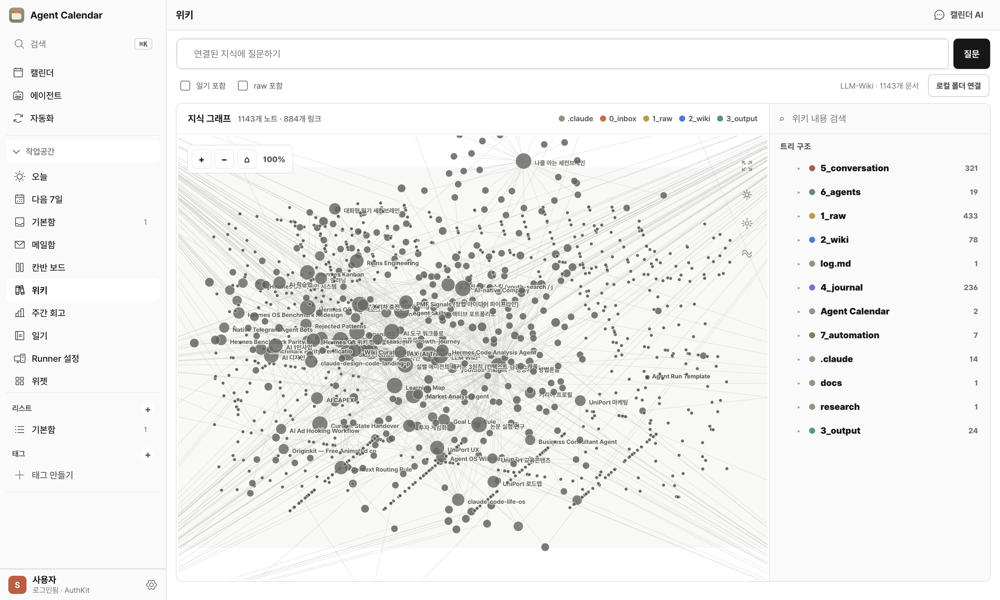

### 10. 주간 회고

이번 주 목표, 완료율, 지연 작업과 에이전트 작업을 함께 보고 회고를 남깁니다. 자동 생성은
초안을 돕는 기능이며, 최종 기록은 사용자가 검토한 뒤 로컬 Wiki의 장기 맥락으로 남습니다.

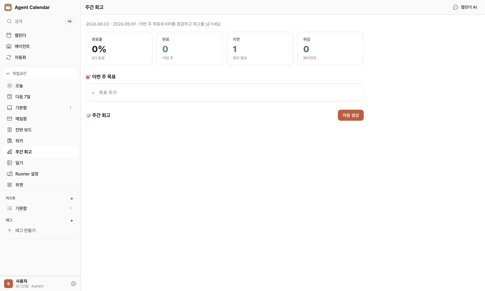

### 11. 일기

기분과 하루의 기록을 남기고 선택한 로컬 Wiki에 저장합니다. 일상 기록도 사용자가 허용한
범위 안에서 다음 대화의 맥락이 되며, 과거 일기 본문은 공개 캡처에서 가렸습니다.

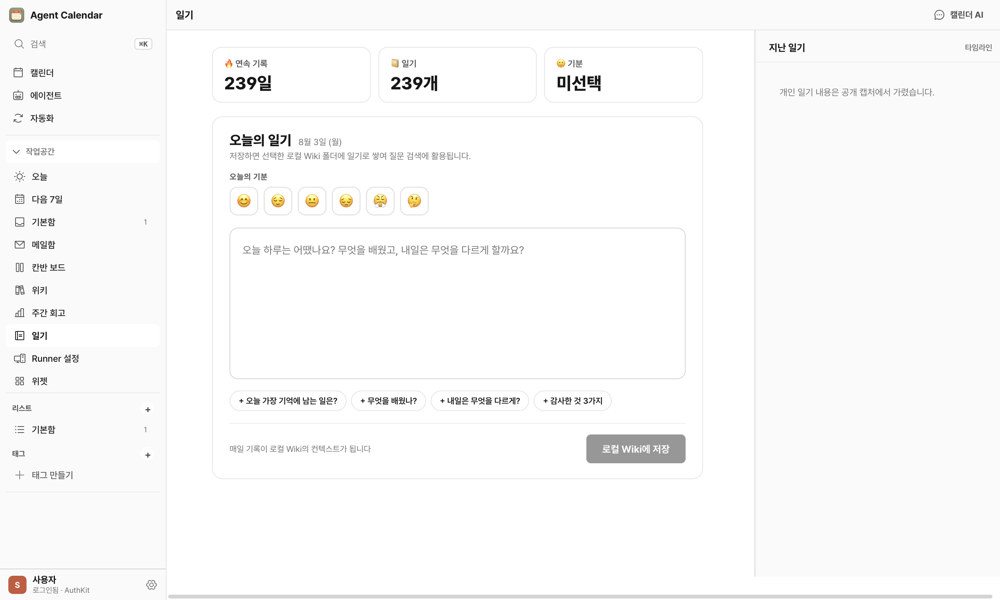

### 12. Runner 설정

Codex, Claude Code, Grok, Hermes를 실행할 사용자 소유 호스트와 엔진 상태를 확인합니다.
실행 엔진 계정과 자격 증명은 중앙 서비스가 아니라 Runner 환경에 남습니다.

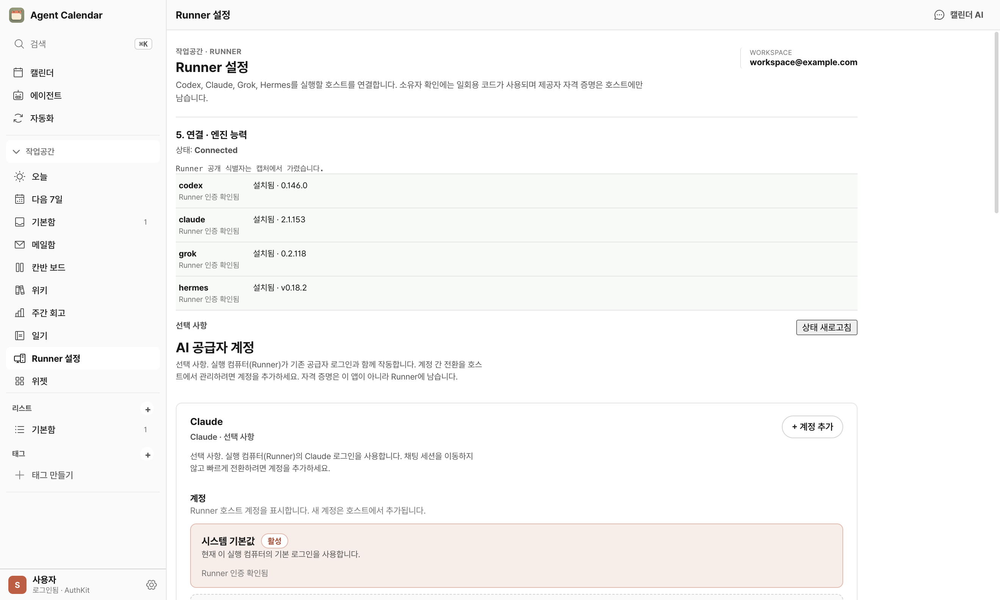

### 13. 위젯

월간 캘린더, 오늘 할 일, 다음 일정과 에이전트 상태를 macOS 데스크톱과 알림 센터에서
확인하는 WidgetKit 화면을 앱 안에서 미리 봅니다.

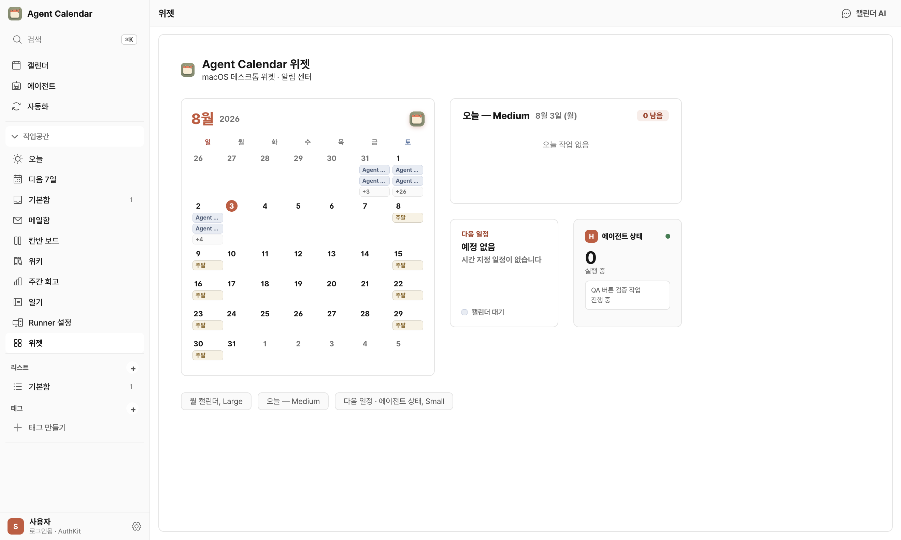

## 핵심 기능

| 영역 | 제품 역할 |
| --- | --- |
| Unified Calendar | 외부 일정, 열린 일, 에이전트 작업, 자동화와 완료 보고를 하나의 시간축에 연결 |
| Calendar AI | 허용된 일정과 기록을 이해하고 요청을 일정, 작업 또는 Wiki 기록으로 전환 |
| Second Brain | 사람, 프로젝트, 목표, 선호와 열린 일을 출처와 함께 정리하고 사용자가 검토·수정 |
| AI Work Studio | 하나의 작업 대화에서 계획, 진행, 개입, 중단, 재시도, 결과와 산출물을 관리 |
| LLM Wiki | 원본 기록을 보존하고 사람, 결정, 아이디어, 일정, 작업과 결과를 출처 기반으로 연결 |
| Automation | 반복 패턴에서 루틴을 제안하고 사용자가 범위와 정책을 확인한 뒤 활성화 |
| Runner | 사용자 소유 환경에서 Codex·Claude Code·Grok·Hermes를 실행하고 자격 증명을 로컬에 유지 |
| Trust | Workspace 격리, 권한 범위, 승인 관문, 출처와 삭제 통제로 사용자 소유권 보장 |

## 신뢰와 데이터 소유권

- 로그인은 Gmail, Google Calendar 또는 실행 엔진 권한을 자동으로 부여하지 않습니다.
- 파일과 폴더는 사용자가 명시적으로 선택한 범위만 사용합니다.
- Workspace의 일정, Wiki, 작업, 에이전트와 Runner 상태는 다른 Workspace와 섞이지 않습니다.
- Codex, Claude, Grok, Hermes 자격 증명은 사용자 소유 Runner 환경에 남습니다.
- 새 권한, 추가 비용, 외부 전달, 구매와 삭제는 승인 정책을 통과해야 합니다.
- 원시 실행 로그보다 사용자가 판단할 수 있는 계획, 진행, 막힘, 근거와 결과를 보여줍니다.

Runner는 제품의 첫 사용 가치가 아니라 사용자 소유 실행 환경을 지키는 하위 아키텍처입니다.
비개발자는 모델, endpoint 또는 provider session을 먼저 선택하지 않고도 작업을 시작할 수
있어야 합니다.

## 아키텍처

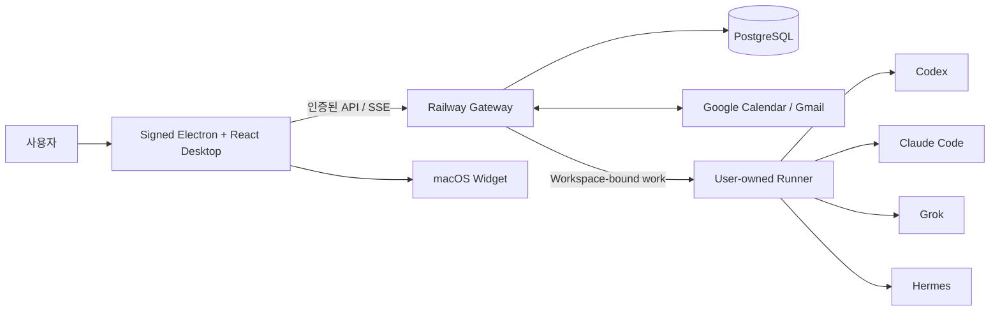

Desktop은 캘린더와 사용자 경험을 소유하고, Railway Gateway는 인증된 Workspace 경계와
제품 데이터를 관리합니다. Runner는 한 Workspace의 작업만 받아 사용자 환경에서 실행하고,
실행 엔진 자격 증명을 중앙 서비스로 이전하지 않습니다.

### 모노레포 구성

```text
apps/
├── desktop/   Electron + React + TypeScript 데스크톱 클라이언트
├── backend/   Railway gateway, 인증, Calendar AI, Source, Work, Automation
├── runner/    사용자 소유 실행 엔진 연결과 작업 실행
├── web/       실제 제품 화면을 사용하는 공개 랜딩과 신뢰 문서
└── widget/    macOS WidgetKit 연동
docs/
├── adr/       인증, 실행, 데이터와 배포 경계의 기술 결정
├── plans/     plan-first 구현 계획과 acceptance gate
└── operations/운영, 복구와 프로덕션 검증 문서
```

## 기술적 설계 원칙

### 캘린더가 제품의 중심

Second Brain, LLM Wiki, 에이전트와 자동화를 별도 홈이나 새로운 AI 대시보드로 만들지
않습니다. 기존 Calendar, Today, Mail, Agent, Automation, Wiki, Diary, Review 화면을
같은 디자인 시스템 안에서 업그레이드합니다.

### 원본과 생성된 기억을 분리

사용자가 허용한 원본 기록은 생성된 요약으로 덮어쓰지 않습니다. 기억된 사실은 출처 또는
사용자 확인을 가지며 수정, 제외와 삭제가 가능합니다.

### 담당 에이전트와 실행 엔진을 분리

사용자가 결과에 대해 책임을 확인하는 대상은 담당 에이전트이고 Codex나 Claude Code 같은
엔진은 실행 수단입니다. 비개발자가 엔진 내부 구조를 이해하지 않아도 일을 시작할 수 있게
이 차이를 UI에서도 유지합니다.

### 승인 관문은 영향에 비례

모든 동작을 확인받는 대신 새 권한, 추가 비용, 외부 전달, 구매와 삭제처럼 되돌리기 어려운
작업만 명시적 승인을 요구합니다. 지원하지 않는 외부 동작은 승인 버튼으로 우회하지 않습니다.

## 로컬에서 확인하기

Node.js `22.x`, npm `10+`가 필요합니다.

### 공개 웹

```bash
npm ci --prefix apps/web
npm --prefix apps/web run dev
```

### Desktop 개발 모드

```bash
npm ci
npm run electron:dev
```

로컬 개발 서버는 빠른 UI 피드백 용도입니다. 로그인, OAuth, Railway API, 패키지 Electron,
실제 Runner와 첫 사용자 여정의 완료 근거로 인정하지 않습니다. 실제 제품 검증에는 WorkOS,
Google OAuth, Railway, PostgreSQL과 사용자 소유 Runner 환경이 필요하며 비밀 값은 저장소에
포함하지 않습니다.

## 검증

변경 범위마다 좁은 검증부터 실행하고, 배포 경계에서는 양쪽 surface와 실제 사용자 흐름을
함께 확인합니다.

```bash
npm run backend:check
npm run test:backend
npm run typecheck
npm --workspace apps/desktop run test
npm run test:runner
npm run build:web
npm run lint:web
```

Desktop UI는 `apps/desktop/tests/`의 Playwright 시나리오로 확인합니다. 프로덕션 완료는
서명된 앱이 Railway와 실제 Runner에 연결된 상태에서 첫 로그인부터 권한 연결, 작업 실행,
개입, 결과 저장과 재접속 복구까지 관찰해야 합니다.

## 프로젝트 문서

- [Agent workflow](AGENTS.md)
- [Product context](CONTEXT.md)
- [Bounded Context와 의존성 방향](CONTEXT-MAP.md)
- [Authoritative Second Brain PRD](docs/PRD-agent-calendar-second-brain.md)
- [Implementation roadmap](docs/plans/2026-08-02-second-brain-implementation-roadmap.md)
- [Production operations](docs/operations/personal-beta-release.md)
- [Plans](docs/plans/README.md)

Medium 이상의 변경은 `docs/plans/`에 계획을 먼저 만들고, 행동 변경은 실패하는 테스트부터
작성합니다. 완료 보고에는 실행한 검증, 건너뛴 검증과 남은 위험을 포함합니다.

---

<div align="center">
  <strong>A calendar that knows your work.</strong><br />
  나를 이해하고, 기억하며, 필요한 일을 실제로 수행합니다.
</div>
