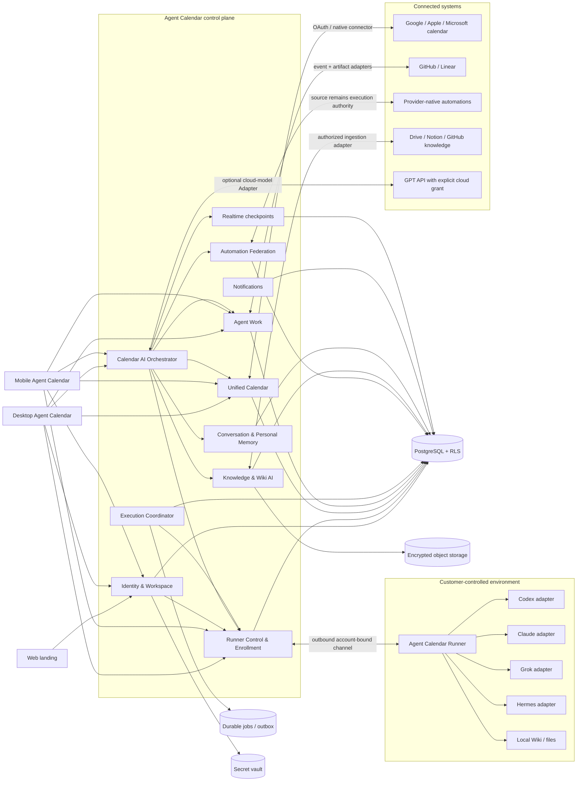

# Plan: Production Agent Calendar Platform

- Date: 2026-07-24
- Owner: Codex
- Work size: Large / Boundary
- Status: Design complete — implementation not started
- Development roadmap: `docs/plans/2026-07-24-production-development-roadmap.md`
- Runner ownership decision: `docs/adr/0008-bind-runners-to-authenticated-workspaces.md`

## Goal

Agent Calendar를 소유자 한 명의 Mac mini와 공용 토큰에 의존하는 개인용 시스템에서,
외부 고객이 자신의 일정, 지식, AI 계정, 실행 환경을 안전하게 연결해 사용하는
프로덕션 제품으로 전환한다.

제품의 중심은 기존 Agent Calendar의 일정 UI다. 사람 일정, 위임 작업, 에이전트 실행,
반복 자동화를 하나의 `Unified Calendar`에서 관찰하고 관리한다. Orca는 CLI 에이전트
연결, 실행 상태, 자동화, 원격 런타임 운용 방식의 벤치마크로 사용하되 제품을
worktree·terminal 중심 IDE로 바꾸지 않는다.

`Calendar AI`는 제한된 일정 검색 기능이 아니라 이 제품의 대화형 진입점이다. 사용자가
연결하고 현재 접근할 수 있는 전체 일정과 작업, 자동화, 지식, `Personal Memory`를
필요할 때 조회해 답하고, 일반적인 대화를 이어가며, 명시적인 요청을 일정 변경이나
`Delegated Work`로 전환한다. 모든 원문을 매번 모델 프롬프트에 넣는 방식은 사용하지
않는다.

## Confirmed Product Decisions

| Topic | Decision |
| --- | --- |
| Product identity | Agent Calendar의 기존 캘린더 중심 기획과 시각 언어를 유지한다. |
| Benchmark | [Orca](https://www.onorca.dev/)의 Runner 연결, agent lifecycle, attention state, automation 방식을 참고한다. |
| First customer shape | 한 명의 사용자가 한 Workspace를 사용하는 단순한 UX로 시작한다. |
| Production ownership | 데이터와 인증은 처음부터 다중 Workspace를 전제로 격리한다. 1인 UX와 단일 테넌트 구현을 혼동하지 않는다. |
| ETE priority | 부분 기능 완료가 아니라 로그인 → Runner 등록 → Engine 인증·준비 → 첫 작업 실행 → 실시간 관제 → Calendar 결과 확인 → 재접속까지의 End-to-End 사용자 여정을 최우선 합격 기준으로 삼는다. |
| Account-first onboarding | 사용자는 Agent Calendar에 로그인한 뒤에만 자신의 Workspace에 Runner를 등록할 수 있다. Pairing code나 Runner URL 자체는 계정 권한이 아니다. |
| Runner ownership | 한 Workspace는 여러 Runner를 가질 수 있지만, 한 Runner profile은 정확히 한 Workspace에만 귀속된다. 다른 사용자의 Runner로 fallback하지 않는다. |
| Per-user operation | 캘린더, Calendar AI, Agent Work, 자동화, Wiki, 알림, credential grant, 실행 이벤트를 포함한 모든 상태와 동작은 인증된 User와 WorkspaceScope에서 시작한다. |
| Product scope | 일정과 개인·업무 운영을 중심으로 코드 구현, 기획·조사, 릴리스 준비까지 연결한다. |
| Compute and AI accounts | 고객이 Runner 호스트와 Codex·Claude·Grok·Hermes 계정을 소유한다. |
| Calendar AI experience | 일정 전용 명령창이 아니라 자연스러운 일상 대화, 전체 일정 질의, 일정 변경, 작업 위임을 하나의 지속 대화에서 제공한다. |
| Calendar AI truth | 일정과 작업의 최신 원본은 각 도메인 Module이다. 모델의 대화 기억이나 요약을 일정 사실의 원본으로 사용하지 않는다. |
| Calendar AI action scope | 대화는 자유롭지만 실제 행동은 연결된 일정, Delegated Work, 자동화, 지식 기능과 정책이 허용한 범위로 제한한다. |
| Calendar AI model | GPT를 우선 대화 모델로 연결하되 모델 공급자와 제품 규칙을 분리한다. 모델은 DB, Runner, credential에 직접 접근하지 않는다. |
| Web | 소개, 가격, 가입, 문서, 데스크톱·모바일 다운로드를 위한 랜딩 페이지다. |
| Desktop | Agent Calendar의 전체 기능을 제공하는 주 제품이다. |
| Mobile | 일정 관리와 에이전트 작업 관제를 제공하는 축소판 Agent Calendar다. Desktop/Web 프로덕션과 v1 계약이 안정화된 뒤 마지막 제품 단계로 개발한다. |
| Calendar | 외부의 사람 일정과 에이전트 작업·자동화 일정을 함께 표시한다. 둘은 같은 시간 자원을 경쟁하지 않으므로 겹침 자체는 충돌이 아니다. |
| Automation | 시간·외부 이벤트·에이전트 제안으로 생성될 수 있다. 기존 자동화는 원래 시스템에서 계속 실행한다. |
| Automation management | Agent Calendar에서 연결된 자동화를 조회, 생성, 수정, 일시정지, 재개, 즉시 실행한다. 변경은 원본 시스템에 반영한다. |
| Automation safety | 사전 허용된 범위는 자동 반영한다. 새 권한, 추가 비용, 새로운 외부 전송은 Approval Gate를 통과한다. |
| Calendar AI / Wiki AI | 모든 검색, 대화, 변경, 문서, 임베딩, 출처가 Workspace와 사용자 권한으로 격리된다. |

## Non-Goals

- v1에 팀 초대, 공동 편집, 엔터프라이즈 SSO/SCIM을 노출하지 않는다.
- Desktop과 Mobile을 병렬 개발하거나 Mobile 전용 임시 Interface를 만들지 않는다.
- 로그인하지 않은 client가 Runner를 등록하거나 연결하지 못하게 한다.
- pairing URL, QR, enrollment code, Runner ID를 지속적인 사용자 인증 수단으로 사용하지
  않는다.
- 한 Runner profile을 여러 Workspace가 공유하거나 global Runner pool에 넣지 않는다.
- User, Workspace, Runner를 request body나 model output만으로 선택하지 않는다.
- Agent Calendar가 고객의 AI 구독이나 실행 컴퓨트를 재판매하지 않는다.
- Orca의 terminal, worktree, built-in editor, diff viewer를 복제하지 않는다.
- 사람 일정을 AI가 임의로 재배치하지 않는다.
- 사용자의 과거 일정 전체를 매 대화마다 하나의 거대한 프롬프트로 전송하지 않는다.
- 모델이 SQL, 외부 캘린더, Runner, provider credential에 직접 접근하지 않는다.
- Calendar AI의 대화 기억을 현재 일정이나 작업 상태의 원본으로 취급하지 않는다.
- 일상 대화가 메시지 발송, 구매, 예약 등 아직 지원하지 않는 외부 행동의 권한이 되지 않는다.
- 사용자에게 보이지 않는 성향 프로필이나 삭제할 수 없는 장기 기억을 만들지 않는다.
- 서로 다른 Execution Engine이나 Runner로 조용히 fallback하지 않는다.
- 기존 자동화를 Agent Calendar로 복사해 중복 실행하지 않는다.
- 소스 시스템이 지원하지 않는 자동화 기능을 지원하는 것처럼 표시하지 않는다.
- 로컬 Wiki 원문이나 provider credential을 기본값으로 control plane에 업로드하지 않는다.
- 현재의 전역 bearer token, file store, process-local relay queue를 production 호환으로 간주하지 않는다.

## Work Size

Large / Boundary다. 아래 계약을 동시에 변경한다.

- 사용자 인증과 Workspace 소유권
- 전체 PostgreSQL 스키마와 저장 의미
- Desktop 인증·설정·API 접근
- Calendar 및 외부 캘린더 동기화
- Calendar AI 지속 대화, 모델, context retrieval, Personal Memory, 작업 위임 계약
- Wiki AI 문서·청크·임베딩·출처 계약
- Runner 등록, lease, 실행 이벤트, credential 위치
- Execution Engine adapter 계약
- 기존 자동화의 federated management 계약
- Mobile 인증·일정·알림·개입 계약
- 배포, migration, backup, observability, incident response

## Touched Boundaries

- Backend gateway: `apps/backend/app/railway-gateway-server.js`
- Backend domain modules: `apps/backend/app/domains/**`
- Backend libraries: `apps/backend/app/lib/**`
- DB/migrations: `apps/backend/app/db/**`
- Desktop API and domain: `apps/desktop/src/api/**`, `apps/desktop/src/domains/**`
- Desktop feature surfaces: `apps/desktop/src/features/**`
- Electron bridge: `apps/desktop/electron/**`
- Mobile: new application boundary, implementation technology deferred
- Widget: `apps/widget/**`
- Tests: `apps/backend/tests/**`, `apps/desktop/tests/**`, new runner/mobile contract suites
- Docs and runbooks: `docs/**`, `CONTEXT.md`, `CONTEXT-MAP.md`

## Current-State Diagnosis

### Control plane

The Railway gateway currently combines authentication, fallback state, relay queue, runtime
translation, Calendar AI, Wiki AI, scheduler translation, and product routes in
`apps/backend/app/railway-gateway-server.js`.

Production blockers:

- one global `HERMES_REMOTE_AUTH_TOKEN` identifies every caller;
- one relay token identifies the Mac mini bridge;
- no relational mapping proves which authenticated User or Workspace owns the bridge;
- Desktop, relay, scheduler, Calendar AI, and Wiki AI cannot derive one consistent per-user
  execution scope;
- relay jobs, events, waiters, and snapshots are process memory;
- the scheduler daemon is process-local;
- a Railway restart can lose queued or in-flight relay work;
- the Mac mini runtime lives outside this repository and is not reproducibly deployed;
- health is mostly a JSON snapshot rather than metrics, traces, alerts, and SLOs.

### Database

The current migrations create the following globally keyed tables without Workspace or User
ownership:

- `agents`
- `tasks`
- `calendar_events`
- `runs`
- `run_logs`
- `chat_messages`
- `wiki_artifacts`
- `scheduler_jobs`
- `state_meta`
- `workboard_pages`
- `documents`
- `wiki_chunks`
- `agent_missions`
- `agent_sessions`
- `agent_session_events`
- `agent_reports`

IDs and foreign keys are global. `owner` is display text, not an authorization subject.
Idempotency chains and advisory locks are process- or mission-scoped rather than
Workspace-scoped. JSON payloads contain additional identity, session, agent, path, and source
fields that are not protected by relational constraints.

### Calendar and Calendar AI

Calendar AI currently builds one search collection from arrays on a hydrated global state,
including tasks, events, external events, scheduler jobs, and other records. It can reason
over this combined state, but there is no authenticated Workspace scope in the data model.

Production blockers:

- a source filter is not an authorization filter;
- cache and retrieval keys can collide across users;
- raw external IDs are not namespaced by connection;
- schedule-first detection is a keyword/regular-expression branch rather than an open
  conversational plan;
- context retrieval truncates to a small heuristic record set and cannot guarantee an exact
  answer over the user's complete authorized schedule history;
- deterministic calendar calculations, semantic lookup, casual conversation, and Agent Work
  delegation do not share one durable conversational Interface;
- Electron and backend fallbacks duplicate schedule-answer heuristics and a fixed legacy
  embedding shape;
- mutations lack a canonical actor, grant, source revision, and Workspace audit record;
- timezone and calendar ownership are not relationally enforced.

### Wiki and Wiki AI

`documents` and `wiki_chunks` use global IDs, paths, source IDs, and one vector index.
The current product also assumes owner-specific Obsidian folders and local absolute paths.

Production blockers:

- the same path can identify different users' documents;
- vector and keyword search have no Workspace predicate enforced by the schema;
- evidence references can reveal another customer's title, excerpt, or path;
- deletion of a source does not define complete chunk/vector/tombstone cleanup;
- local file paths and private Wiki names can leak into events, errors, and reports;
- one fixed `vector(256)` representation couples all customers and models to a legacy embedding contract.

### Desktop and mobile

The Electron shell stores one connection profile and forwards one Railway bearer token through
a loopback proxy. Local Wiki interception, settings, widgets, deep links, and remote API
forwarding share this shell.

There is no production mobile application today. The macOS widget uses an App Group snapshot
and has no Workspace identity.

## Orca Benchmark: Adopt and Deliberately Reject

### Adopt

- Customer-owned compute and subscriptions. Orca supports local, SSH, self-hosted server, and
  customer-funded disposable environments rather than selling hosted compute
  ([Ways to run Orca](https://www.onorca.dev/docs/ways-to-run)).
- A simple custom agent connection: command, arguments, startup hook, lifecycle status
  ([Custom CLI agents](https://www.onorca.dev/docs/agents/custom-cli)).
- Remote execution that owns the agent process and credentials on the remote host while clients
  remain control surfaces
  ([Remote Orca Servers](https://www.onorca.dev/docs/remote-servers)).
- One-time pairing followed by separately revocable client grants and visible connection state,
  while replacing Orca's direct runtime authority with Agent Calendar account and Workspace
  authorization.
- Visible working, waiting, idle, exited, and restart states instead of invented progress.
- Disabled-first automation creation, inspection, test run, then enable
  ([Scheduled automations](https://www.onorca.dev/docs/cli/automations)).
- Local provider usage and rate-limit visibility with an explicit freshness caveat
  ([Usage tracking](https://www.onorca.dev/docs/agents/usage-tracking)).
- Persistent attention indicators and notifications that deep-link to the affected work
  ([Notifications](https://www.onorca.dev/docs/notifications)).
- A mobile companion focused on monitoring and small interventions rather than full desktop
  parity ([Mobile companion](https://www.onorca.dev/docs/mobile)).

### GUI reference procedure at implementation time

Orca changes quickly, so this plan does not freeze today's screenshots as a permanent UI
specification. Immediately before Desktop Runner Setup implementation:

1. Search for the latest official Orca GUI walkthrough or release video covering remote-server
   setup, pairing, provider readiness, connection state, and revocation.
2. Cross-check the video against the current
   [Remote Orca Servers](https://www.onorca.dev/docs/remote-servers),
   [Settings](https://www.onorca.dev/docs/settings), and
   [Mobile pairing](https://www.onorca.dev/docs/mobile) documentation and the latest released app.
3. Record source URL, capture date, Orca version, every screen/action, visible status transition,
   error recovery, and the point at which the user considers setup complete.
4. Produce an adopt/deviate table before writing UI code. Follow Orca's proven interaction order
   where it fits, while inserting Agent Calendar's mandatory sign-in, Workspace binding, pending
   device, and owner fingerprint confirmation before activation.
5. Run a side-by-side walkthrough after implementation. Reuse interaction principles and order,
   not Orca artwork, copy, or terminal-first information architecture.

If no current official video is available, the current released app plus official documentation
and screenshots become the reference. A third-party video may reveal usability details but cannot
override current security or product contracts.

### Reject

- Worktree, terminal, and diff as the top-level product information architecture.
- Full-autonomy or permission-bypass flags as a default safety model.
- A pairing URL that directly grants broad runtime access to a mobile or desktop client.
- A Runner connection that exists independently of an authenticated Agent Calendar account and
  Workspace membership.
- Provider-specific terminal output as the product's canonical execution event.
- Local provider usage files as authoritative billing or policy data.
- Closing the desktop app as a reason for cloud schedule, audit, or notification state to vanish.

## Target Topology



### Deployment shape

- The control plane is stateless at the HTTP layer.
- PostgreSQL is the source of truth for Workspace state, schedules, jobs, leases, events,
  projections, and audit.
- A separate worker process owns due-work evaluation, connector sync, and outbox delivery.
- Runner Enrollment requires an authenticated Workspace owner, then exchanges a single-use
  challenge for a revocable device identity bound to exactly one Workspace.
- Runner connections are outbound-only and authenticate with the bound device identity; Desktop
  and Mobile authenticate as Users and never hold the Runner credential.
- Calendar AI persists a Turn before inference; a worker owns model/tool progression and writes
  durable stream events so an API restart does not lose the conversation or repeat an action.
- `ConversationModel` selects only the user-configured cloud-model or runner-model Adapter. It
  does not silently route to another provider.
- Redis may accelerate presence or pub/sub but is never the source of truth.
- Object storage holds encrypted large artifacts and opted-in cloud knowledge.
- A secret vault holds refresh tokens for cloud OAuth adapters. PostgreSQL stores only secret
  references.
- Runner/provider credentials stay in the customer's OS credential store.
- The existing Mac mini relay becomes a compatibility Adapter for one Runner, not a privileged
  system-wide runtime.

## Ownership Model

| Asset | Production owner | Stored where |
| --- | --- | --- |
| User identity and session | Agent Calendar | Identity provider + control plane |
| Workspace metadata and policy | Customer, administered through Agent Calendar | PostgreSQL |
| Runner ownership and public identity | Customer Workspace | Public identity and revocation state in PostgreSQL; private device key on Runner |
| One-time Runner Enrollment challenge | Agent Calendar control plane | Hashed, short-lived record in PostgreSQL |
| Calendar OAuth grant | Customer grant, Agent Calendar custodian when cloud sync is required | Secret vault reference |
| Codex/Claude/Grok/Hermes credential | Customer | Runner OS credential store |
| Local Wiki files | Customer | Customer filesystem |
| Opted-in cloud Wiki copy | Customer | Encrypted object storage |
| Calendar AI conversation and Personal Memory | Customer | Workspace-scoped PostgreSQL; encrypted archival storage where required |
| GPT cloud-model credential, when explicitly connected | Customer | Secret vault reference |
| Delegated Work and Work Conversation | Customer | PostgreSQL |
| Execution job, attempt, lease, checkpoints | Agent Calendar control plane | PostgreSQL |
| Provider-native automation definition | Source provider | Source provider; normalized projection in PostgreSQL |
| Audit record | Agent Calendar control plane | Append-only PostgreSQL table / archival store |

## Domain Model

### Identity and Platform

- `User`: one authenticated human identity.
- `Workspace`: the ownership and isolation root for all product data.
- `WorkspaceMembership`: relation between a User and Workspace. v1 creates one `owner`
  membership and does not expose invitations.
- `ConnectorGrant`: a Workspace-scoped authorization to an external system.
- `RunnerEnrollment`: one owner-authorized, single-use exchange that binds a host public identity
  to one Workspace.
- `RunnerIdentity`: the revocable device identity used by an enrolled Runner to connect.
- `Runner`: a customer-controlled execution host enrolled in exactly one Workspace. One Workspace
  may own multiple Runners.
- `EngineBinding`: one Engine available on one Runner under a local credential binding.

### Unified Calendar

- `CalendarSource`: one external or internal source of schedule entries.
- `CalendarEntry`: normalized projection of a human event, Delegated Work schedule, or automation
  occurrence.
- `AgentWorkSchedule`: desired start, deadline, recurrence, and execution policy for agent work.
- `AutomationOccurrence`: one expected or actual run of a Connected Automation.

Human and agent CalendarEntries may overlap. `conflict` is reserved for contradictory writes to
the same source record, not overlapping time.

### Calendar AI

- `Calendar AI Conversation`: a durable general conversation with Calendar AI. It can discuss
  schedules or ordinary topics and can create typed actions, but it is not attached to one
  Delegated Work.
- `Calendar AI Turn`: one user input and the resulting model output, evidence, tool calls, action
  receipts, and terminal status.
- `Context Snapshot`: an immutable record of the authorized source IDs, versions, time range,
  retrieval policy, and model used for one Turn. Large source content remains outside the row.
- `Personal Memory`: a user-visible, provenance-bearing fact or preference retained across
  Calendar AI Conversations. It never substitutes for current calendar or work state.
- `Action Draft`: a typed, reviewable calendar command, Delegated Work request, AutomationChange,
  or memory change produced from a Turn before policy evaluation.

`Calendar AI Conversation` and `Work Conversation` are intentionally distinct. The first is the
general personal entry point; the second is the accountable record of one Delegated Work. When a
Calendar AI Turn delegates work, it creates a Delegated Work and links to its Work Conversation.

### Agent Work

Existing `Delegated Work`, `Responsible Agent`, `Work Conversation`, `Work Checkpoint`,
`Intervention`, `Approval Gate`, `수정 차수`, and `Follow-up Work` meanings remain.

Add:

- `ExecutionRequest`: immutable policy and context snapshot for one attempt.
- `ExecutionAttempt`: one claim-to-terminal lifecycle.
- `ExecutionLease`: time-bounded ownership of an attempt by a Runner.
- `ExecutionEvidence`: provider/model/runner/tool/artifact evidence supporting resolved execution
  facts.

### Automation

- `AutomationSource`: one connected authority such as Hermes cron, a Runner automation adapter,
  or another provider-native automation system.
- `Connected Automation`: the local projection of a source-owned automation.
- `AutomationCapability`: source-reported support for list/create/update/pause/resume/run/delete,
  triggers, session reuse, and run history.
- `AutomationChange`: a versioned desired change with actor, policy classification, and
  idempotency key.
- `AutomationSyncCursor`: source-specific reconciliation position.

### Knowledge

- `KnowledgeSource`: a Workspace-scoped local or cloud corpus.
- `KnowledgeDocument`: stable document identity independent of local absolute path.
- `KnowledgeVersion`: immutable content version and hash.
- `EmbeddingCollection`: model, dimension, normalization, and lifecycle for a compatible vector
  set.
- `KnowledgeChunk`: versioned text and vector member owned by exactly one Workspace and source.
- `EvidenceReference`: permission-checked reference shown to the user instead of a raw path.

## Interface Design It Twice

### Alternative 1: one universal command Module

```ts
dispatch(scope, command): Promise<Receipt>
observe(scope, stream, cursor): Promise<EventPage>
```

Strength:

- tiny Interface;
- high leverage for generic clients.

Weakness:

- the command envelope becomes a hidden untyped protocol;
- Calendar, execution, and automation error semantics collapse together;
- callers need provider-specific knowledge to build valid payloads;
- a shallow switch statement is likely to grow behind the seam.

### Alternative 2: direct provider Interfaces

```ts
codex.start(...)
claude.start(...)
hermes.cron.update(...)
googleCalendar.patch(...)
```

Strength:

- maximum provider flexibility;
- easy to expose every provider feature.

Weakness:

- very low locality;
- UI and tests learn every provider;
- adding an Engine changes many callers;
- Work Checkpoints and error truth diverge by provider.

### Alternative 3: calendar command Module

```ts
schedule(scope, calendarIntent): Promise<CalendarReceipt>
readTimeline(scope, range): Promise<UnifiedCalendar>
```

Strength:

- common caller is trivial;
- calendar remains the product center.

Weakness:

- long-running execution, live intervention, and provider-native automation reconciliation are
  awkwardly hidden inside calendar commands;
- the Calendar Module becomes a god Module.

### Alternative 4: deep capability Modules with a small external seam — selected

Use six deep Modules with distinct Interfaces:

1. `UnifiedCalendar`
2. `AgentWork`
3. `RunnerControl`
4. `ExecutionCoordinator`
5. `AutomationFederation`
6. `CalendarAI`

Calendar callers never learn Runner transport. Execution callers never learn provider stdout.
Automation callers never learn source-specific mutation syntax. The Work Conversation composes
their projections without becoming an execution adapter.

This design has the strongest depth and locality:

- Runner and Engine volatility is contained in `ExecutionCoordinator`;
- account-authorized Runner Enrollment, device identity, connection, capability, and revocation
  are contained in `RunnerControl`;
- Delegated Work lifecycle, Work Conversation, and product-level interventions are contained in
  `AgentWork`;
- source automation volatility is contained in `AutomationFederation`;
- schedule projection and external calendar write conflicts are contained in `UnifiedCalendar`;
- model prompts, context assembly, conversation persistence, and action planning are contained in
  `CalendarAI`;
- Calendar AI and human UI cross the same capability Interfaces as tests.

### Calendar AI alternatives inside the selected shape

#### A. Full schedule prompt on every Turn — rejected

```ts
answer(message, everyCalendarRecord, chatHistory): Promise<string>
```

This appears intelligent in a demo but becomes stale, expensive, slow, impossible to authorize
precisely, and eventually too large for a model context window. Exact counts and availability
also depend on model arithmetic.

#### B. Fixed intent router — rejected

```ts
route(message): 'small-talk' | 'schedule-search' | 'calendar-write' | 'delegate-work'
```

This makes common commands predictable but repeats the current limitation: mixed or novel
requests fall through, conversation feels scripted, and every capability adds another branch.

#### C. Model with direct database and tool access — rejected

```ts
chat(scope, message, database, tools): Promise<ModelOutput>
```

This maximizes short-term flexibility but exposes authorization, schema, provider details, and
side-effect semantics at the model seam. Prompt injection can become an authorization decision,
and tests must understand every tool.

#### D. Deep CalendarAI Module over typed capability Interfaces — selected

```ts
submitTurn(scope, input): Promise<TurnAccepted>
readConversation(scope, conversationId, after): Promise<ConversationView>
```

The Module chooses a bounded retrieval plan, uses deterministic capability Interfaces for facts
and actions, invokes GPT with an authorized context pack, validates model output, applies policy,
and persists evidence. This gives natural conversation without making the model a database client
or authorization subject.

## Selected Module Interfaces

### RunnerControl

```ts
interface RunnerControl {
  beginEnrollment(
    scope: WorkspaceScope,
    request: RunnerEnrollmentRequest,
  ): Promise<RunnerEnrollmentChallenge>;

  submitEnrollmentProof(
    proof: RunnerEnrollmentProof,
  ): Promise<PendingRunnerEnrollment>;

  confirmEnrollment(
    scope: WorkspaceScope,
    confirmation: RunnerFingerprintConfirmation,
  ): Promise<RunnerActivationReceipt>;

  read(
    scope: WorkspaceScope,
    runnerId?: string,
  ): Promise<RunnerFleetView>;

  revoke(
    scope: WorkspaceScope,
    runnerId: string,
  ): Promise<RunnerRevocationReceipt>;
}
```

Interface invariants:

- `beginEnrollment` requires an authenticated owner membership; a User cannot create enrollment
  for a Workspace they do not own.
- An enrollment challenge is opaque, hashed at rest, short-lived, single-use, and limited to one
  declared Runner profile.
- `submitEnrollmentProof` consumes the challenge and creates only a pending identity bound to the
  Workspace and actor stored in the challenge. It accepts no caller-selected Workspace and does
  not issue a runtime credential.
- The pending response contains only the enrollment ID, verification fingerprint, expiry, and a
  one-purpose continuation handle that cannot authenticate runtime work.
- `confirmEnrollment` requires the same Workspace's authenticated owner to verify the displayed
  device fingerprint. Only confirmed devices become active and receive a runtime credential
  through the waiting Runner channel.
- One Runner profile belongs to exactly one Workspace; one Workspace may enroll multiple
  Runners.
- The control plane stores public identity and revocation state. The Runner stores its private
  device credential and provider credentials.
- Desktop and Mobile User sessions may read permitted Runner state but never receive a Runner
  device credential or broad pairing secret.
- Every offer, event, artifact, heartbeat, and local capability is checked against the Runner's
  bound Workspace and current revocation state.
- Revocation stops new offers and rejects later heartbeats, events, artifacts, and completions.
- `ExecutionCoordinator` may select only eligible Runners returned under the request's existing
  WorkspaceScope. No cross-Workspace or silent Runner fallback exists.

Error families:

- `owner_membership_required`
- `enrollment_expired`
- `enrollment_replayed`
- `device_proof_invalid`
- `fingerprint_confirmation_required`
- `fingerprint_mismatch`
- `runner_already_enrolled`
- `runner_revoked`
- `protocol_incompatible`
- `workspace_mismatch`

Internal seams and Adapters:

- `RunnerIdentityStore` with PostgreSQL and in-memory test Adapters.
- `RunnerTransport` with outbound WebSocket/long-poll and deterministic fake Adapters.
- `DeviceCredentialIssuer` with production key/certificate and test Adapters.
- Engine and local-capability probes remain Runner-side and return redacted capability evidence.

### CalendarAI

```ts
interface CalendarAI {
  submitTurn(
    scope: WorkspaceScope,
    input: CalendarAITurnInput,
  ): Promise<CalendarAITurnAccepted>;

  readConversation(
    scope: WorkspaceScope,
    conversationId: string,
    after?: EventCursor,
  ): Promise<CalendarAIConversationView>;
}
```

`CalendarAITurnInput` contains a message, client request ID, optional conversation ID, UI
surface, locale, and timezone. It never contains a trusted Workspace, source grant, tool list,
or model credential.

Interface invariants:

- `(workspaceId, clientRequestId)` is unique and replay-safe.
- Every Turn belongs to exactly one Workspace, User actor, and Calendar AI Conversation.
- Calendar and work facts are fetched from their owning Modules at Turn time; conversation
  summaries and Personal Memory are never treated as current schedule truth.
- The model cannot choose Workspace, membership, CalendarSources, KnowledgeSources, or tools.
- Exact date, count, duration, recurrence, and availability answers use structured queries and
  deterministic computation rather than vector similarity or model arithmetic.
- Semantic retrieval is allowed for titles, notes, prior conversation, and Knowledge, but every
  returned reference is re-authorized before it reaches the model and again before projection.
- Model output is untrusted structured input. An action executes only after schema validation,
  policy evaluation, source revision checks, and idempotency protection.
- Casual conversation may complete without retrieving schedule data or invoking a tool.
- A work request creates a Delegated Work through the Agent Work Module; Calendar AI never starts
  a Runner directly.
- A Calendar AI action that creates Delegated Work links the originating Turn to the new Work
  Conversation and returns a durable receipt.
- Personal Memory is visible, attributable, editable, forgettable, and excluded immediately when
  revoked.
- One Turn has one terminal state: `answered`, `action_applied`, `approval_required`, `blocked`,
  `failed`, or `cancelled`.
- Model or Runner failure is shown truthfully; the system does not replace GPT with a canned
  response while claiming an AI answer.

Error families:

- `model_unavailable`
- `model_auth_required`
- `context_source_unavailable`
- `context_too_broad`
- `action_ambiguous`
- `action_conflict`
- `approval_required`
- `policy_denied`
- `unsupported_action`
- `conversation_not_found`

Internal seams and Adapters:

- `ConversationModel` with an OpenAI cloud-model Adapter, a Runner-local model Adapter, and a
  deterministic fake Adapter for contract tests.
- `ConversationLedger` with PostgreSQL and in-memory test Adapters.
- `UnifiedCalendar`, Agent Work, `AutomationFederation`, Knowledge, and policy Interfaces.
- `ContextAssembler` remains internal Implementation: it selects sources, range, structured
  queries, semantic retrieval, context budget, redaction, and citations.

### AgentWork

```ts
interface AgentWork {
  delegate(
    scope: WorkspaceScope,
    draft: DelegatedWorkDraft,
  ): Promise<DelegationReceipt>;

  read(
    scope: WorkspaceScope,
    delegatedWorkId: string,
    after?: EventCursor,
  ): Promise<DelegatedWorkView>;

  intervene(
    scope: WorkspaceScope,
    delegatedWorkId: string,
    command: WorkIntervention,
  ): Promise<InterventionReceipt>;
}
```

Interface invariants:

- `(workspaceId, clientRequestId)` creates at most one Delegated Work.
- One Delegated Work owns one Work Conversation and one visible Responsible Agent.
- Delegation records objective, deliverable, success criteria, due time, source references,
  actor, origin Turn, and policy result.
- Source context is passed as authorized references and immutable snapshots, not a raw Calendar
  AI Conversation dump.
- `delegate` returns `drafted`, `approval_required`, `scheduled`, or `rejected`; it never claims
  execution completion.
- Agent Work owns product lifecycle and calls `ExecutionCoordinator` internally when execution
  is authorized.
- Calendar projection is derived from Agent Work state and is not separate mutable truth.
- Calendar AI, Desktop, and Mobile use the same Interface.

### ExecutionCoordinator

```ts
interface ExecutionCoordinator {
  submit(
    scope: WorkspaceScope,
    request: ExecutionRequest,
  ): Promise<ExecutionAccepted>;

  read(
    scope: WorkspaceScope,
    executionId: string,
    after?: EventCursor,
  ): Promise<ExecutionView>;

  intervene(
    scope: WorkspaceScope,
    executionId: string,
    command: ExecutionCommand,
  ): Promise<InterventionReceipt>;
}
```

Interface invariants:

- `(workspaceId, clientRequestId)` is unique and replay-safe.
- One accepted request has immutable requested Engine, policy, context references, budget, and
  deadline.
- The selected Runner and resolved Engine are recorded only from execution evidence.
- No silent Runner or Engine fallback occurs.
- One active attempt owns one unexpired fenced lease.
- Events are monotonic per attempt and accept idempotent replay.
- Exactly one terminal event exists per attempt.
- A stale Runner cannot complete work after its lease is fenced.
- `cancel_requested` and `cancelled` are different states.
- A read never returns an event from another Workspace.
- Provider credentials and private local paths never cross the Interface.

Error families:

- `no_eligible_runner`
- `engine_not_ready`
- `runner_offline`
- `lease_expired`
- `policy_denied`
- `approval_required`
- `budget_exceeded`
- `provider_rate_limited`
- `provider_auth_required`
- `execution_interrupted`
- `conflict`

Internal seams and Adapters:

- `RunnerDirectory` with PostgreSQL and in-memory test Adapters.
- `ExecutionLedger` with PostgreSQL and in-memory test Adapters.
- `RunnerTransport` with outbound WebSocket/long-poll production Adapter and fake test Adapter.
- Runner-local `EngineAdapter` for Codex, Claude, Grok, Hermes, and fake engines.

### AutomationFederation

```ts
interface AutomationFederation {
  synchronize(
    scope: WorkspaceScope,
    sourceId: string,
    cursor?: string,
  ): Promise<AutomationSyncResult>;

  read(
    scope: WorkspaceScope,
    query: AutomationQuery,
  ): Promise<AutomationPage>;

  apply(
    scope: WorkspaceScope,
    change: AutomationChange,
  ): Promise<AutomationChangeReceipt>;
}
```

Interface invariants:

- The source system remains execution authority.
- A Connected Automation is unique by `(workspaceId, sourceId, externalId)`.
- Source revision/ETag preconditions prevent lost updates.
- Agent Calendar never claims success until the source Adapter confirms it.
- Unsupported capabilities fail closed and remain visible.
- Reconciliation deduplicates occurrences and run history.
- A stale projection displays `stale`, not `active`.
- New permission, added cost, or new external delivery creates an Approval Gate.
- A create starts disabled when the source supports it; test-run precedes enable.
- Delete is deferred from v1 unless the source supports reversible deletion and the user confirms.

Source Adapter capabilities:

```ts
interface AutomationSourceAdapter {
  capabilities(connection: SourceConnection): Promise<AutomationCapabilities>;
  list(connection: SourceConnection, cursor?: string): Promise<SourceAutomationPage>;
  create(connection: SourceConnection, draft: SourceAutomationDraft): Promise<SourceAutomation>;
  update(connection: SourceConnection, change: SourceAutomationPatch): Promise<SourceAutomation>;
  pause(connection: SourceConnection, id: string, revision: string): Promise<SourceAutomation>;
  resume(connection: SourceConnection, id: string, revision: string): Promise<SourceAutomation>;
  run(connection: SourceConnection, id: string, requestId: string): Promise<SourceRun>;
}
```

Initial Adapters:

- Hermes cron
- Agent Calendar Runner automation
- Provider automation adapters only where a supported, stable control surface exists
- fake in-memory Adapter for contract tests

Codex, Claude, Grok, or GPT labels do not imply identical automation capabilities. Each Adapter
must report what it can truthfully perform.

### UnifiedCalendar

```ts
interface UnifiedCalendar {
  read(
    scope: WorkspaceScope,
    range: CalendarRange,
    filters?: CalendarFilters,
  ): Promise<CalendarTimeline>;

  apply(
    scope: WorkspaceScope,
    command: CalendarCommand,
  ): Promise<CalendarMutationReceipt>;
}
```

Interface invariants:

- Every entry includes Workspace, source, external identity, version, timezone, and access mode.
- Human event overlap with agent work is valid.
- Mutation requires the source revision or an explicit conflict-resolution flow.
- Read-only calendars never expose mutation controls.
- Delegated Work and automation state is projected from their owning Modules, not duplicated as
  independent mutable calendar truth.
- Calendar AI and human UI mutations use the same Interface.

## Multi-Tenant Identity and Authorization

### User-facing shape

- Signup creates one User, one Workspace, and one owner membership.
- v1 hides invitations and role management.
- The user does not choose or type a tenant ID.
- Desktop and mobile sessions may access only Workspace memberships in their signed session.
- The exact login provider or method is an authentication Adapter choice. Email, OAuth, or a
  named identity service may change the login screen, but never the Workspace or Runner ownership
  rules below.

The first-run path is account-first and observable end to end:

1. The user signs in to Agent Calendar.
2. The control plane resolves or creates the User, Workspace, and owner membership.
3. Desktop opens **Runner Setup** for that authenticated Workspace.
4. The user downloads or installs the signed Runner on a customer-controlled host.
5. An authenticated Workspace owner creates a short-lived, single-use enrollment code or QR.
6. The Runner creates its device key locally and exchanges the enrollment challenge plus public
   identity over TLS, creating a pending device with a short verification fingerprint.
7. The signed-in owner confirms the matching fingerprint in Desktop. Only then does the control
   plane activate the Runner in the Workspace stored on the challenge and deliver a separately
   revocable device credential to the waiting Runner. The Runner never chooses `workspaceId`.
8. The active Runner probes Codex, Claude, Grok, Hermes, automation, and local-knowledge capabilities.
   The user explicitly enables supported capabilities and completes a connection test.
9. The product shows the Runner as `ready`; actions needing local execution remain unavailable
   with a specific setup action until an eligible Runner is ready.

Setup is not considered complete merely because the Runner socket is connected. The production
golden ETE journey continues:

10. The user authenticates or selects a supported Engine on the Runner host.
11. Desktop shows that Engine as ready using redacted capability evidence.
12. The user creates one Delegated Work from Calendar AI or Agent Work.
13. The control plane persists a Workspace-scoped job and offers it only to an eligible Runner
    bound to that Workspace.
14. The Runner executes it, while durable Work Checkpoints and attention states appear in the
    Work Conversation.
15. Completion updates the Delegated Work and its Unified Calendar projection with a linked
    result or artifact.
16. After Desktop restart, User re-login, or Runner reconnect, the same persisted state resumes
    without duplicate work.

### Authorization shape

- Replace the shared bearer token with short-lived user sessions and refresh-token rotation.
- Resolve `WorkspaceScope` at the HTTP seam from authenticated membership; never trust a body
  `workspaceId` alone.
- Every repository method requires a `WorkspaceScope`.
- Every cache key, idempotency key, event cursor, object key, vector query, and rate-limit key
  includes Workspace.
- Every Calendar AI Turn resolves its own source grants server-side. A conversation ID, citation,
  context snapshot, or model tool argument never carries authorization by itself.
- Personal Memory, conversation summaries, model inputs, tool outputs, and action receipts are
  subject to the same Workspace scope and retention policy as primary records.
- Cross-Workspace access returns the same not-found response as a missing record.
- PostgreSQL RLS is defense in depth, not a substitute for application authorization.
- Production application roles must not use `BYPASSRLS`.
- A User session authorizes product actions; a Runner device identity authorizes only that
  enrolled host. Neither credential can be exchanged for the other's authority.
- Every Runner offer, event, artifact, heartbeat, and capability result must match the
  Workspace bound to the authenticated Runner identity. A body `runnerId`, enrollment code,
  model output, or stale connection never overrides that binding.
- Calendar, Calendar AI, Agent Work, Automation, Wiki, notification, connector, and execution
  flows all begin with the authenticated User and resolved `WorkspaceScope`, even when the work
  itself executes in the cloud rather than on a Runner.

### Secret placement

Two connector kinds are supported:

1. `cloud-grant`: Google/Microsoft calendar, GitHub, Linear, an explicitly connected OpenAI API
   credential, and other services that need cloud webhook, background sync, or always-on model
   inference. Refresh secrets and API credentials live in a vault.
2. `runner-local`: CLI credentials, local Wiki, Apple-native data, Hermes runtime, or systems
   reachable only from the customer network. Secrets stay on the Runner.

The control plane stores connection ID, scope, capability, status, last-verified time, and vault
reference where applicable. It does not return refresh tokens to Desktop or Mobile.

The Runner stores its device private key and provider credentials in the host OS credential
store. The control plane stores only the Runner public identity, credential hash/reference,
Workspace binding, capabilities, and revocation state. Desktop and Mobile never receive a Runner
device credential.

### Calendar AI model availability

Recommended production modes:

1. `cloud-model`: the customer explicitly connects a model API grant. Calendar AI remains
   available on Desktop and Mobile while the personal Runner is offline.
2. `runner-model`: inference uses a customer-owned model capability on an enrolled Runner. No
   model credential enters the control plane, but conversational AI is unavailable while every
   eligible Runner is offline.

An end-user chat or CLI subscription is not assumed to be interchangeable with a model API
credential. If Agent Calendar later includes model usage in its own price, that is a separate
commercial and data-processing decision rather than an implicit fallback.

For the OpenAI cloud-model Adapter:

- ChatGPT subscription billing and API billing are separate
  ([OpenAI Help](https://help.openai.com/en/articles/8156019)).
- API credentials stay in the server-side vault and are never shipped to Desktop or Mobile, in
  line with the official
  [authentication guidance](https://developers.openai.com/api/reference/overview#authentication).
- Agent Calendar's ConversationLedger remains canonical. Provider-hosted conversation state is
  disabled by default, and launch policy must account for the provider's current
  [data controls and retention](https://developers.openai.com/api/docs/guides/your-data#default-usage-policies-by-endpoint).

## Database Target Model

### New ownership tables

- `users`
- `auth_identities`
- `workspaces`
- `workspace_memberships`
- `user_sessions`
- `connector_grants`
- `audit_events`
- `idempotency_keys`

### Runner and execution tables

- `runners`
- `runner_enrollments`
- `runner_identities`
- `runner_sessions`
- `runner_capabilities`
- `runner_engine_bindings`
- `runner_heartbeats`
- `execution_jobs`
- `execution_attempts`
- `execution_leases`
- `execution_events`
- `execution_artifacts`
- `usage_observations`

### Calendar tables

- `calendar_sources`
- `external_calendar_events`
- `calendar_occurrences`
- `calendar_source_coverage`
- `calendar_sync_cursors`
- `calendar_mutation_receipts`

Existing `tasks` and `calendar_events` remain product projections but become Workspace-owned and
source-aware. `calendar_occurrences` is a rebuildable, versioned projection for bounded recurrence
expansion; source events and owning domain records remain canonical.

### Calendar AI tables

- `calendar_ai_conversations`
- `calendar_ai_turns`
- `calendar_ai_events`
- `calendar_ai_context_snapshots`
- `personal_memories`

Turn events persist model, retrieval, tool, action, approval, citation, and terminal checkpoints
as a redacted durable stream. Context snapshots store references, versions, policies, token
budgets, and hashes rather than copying every source record. Personal Memory stores provenance,
sensitivity, retention, and revocation fields. Conversation content follows a Workspace retention
policy and encrypted storage; raw assembled prompts are not retained by default.

### Automation tables

- `automation_sources`
- `connected_automations`
- `automation_occurrences`
- `automation_sync_cursors`
- `automation_change_receipts`

The existing `scheduler_jobs` table becomes a legacy projection during migration and is removed
only after all clients read `connected_automations`.

### Knowledge tables

- `knowledge_sources`
- `knowledge_documents`
- `knowledge_versions`
- `embedding_collections`
- `knowledge_chunks`
- `ingestion_jobs`
- `evidence_references`

The existing `documents` and `wiki_chunks` tables are migrated, not modified in place as the
final model.

### Workspace ownership on every existing table

All current tables receive a non-null `workspace_id`, either directly or through a
Workspace-preserving composite foreign key. Child tables also carry `workspace_id` so RLS and
partition/index selection do not depend on joins.

Required examples:

- `unique (workspace_id, id)`
- `foreign key (workspace_id, run_id) references runs(workspace_id, id)`
- `unique (workspace_id, session_id, sequence)`
- `unique (workspace_id, scope, idempotency_key)`
- `unique (workspace_id, source_connection_id, external_id)`

Global IDs may remain globally unique, but authorization and relational integrity never rely on
that assumption.

## Calendar and Calendar AI Design

### Calendar sources

- internal personal task/event source;
- external human calendars;
- Delegated Work projection;
- Connected Automation projection.

Each source records:

- Workspace and owner User;
- provider type and account label;
- read/write capability;
- selected calendars;
- timezone;
- sync cursor and webhook status;
- credential reference;
- last successful and attempted sync;
- error category and retry time.

### What “knows all my schedules” means

Calendar AI can query every CalendarEntry in every currently authorized CalendarSource across
the source's retained and synchronized history. It does not preload or memorize every entry.

Each answer carries a coverage statement derived from source state:

- which sources were included;
- the time range actually searched;
- last successful sync and staleness;
- unavailable, disconnected, or partially synchronized sources;
- whether the answer used exact records, aggregates, semantic matches, or Personal Memory.

If a user asks a lifetime-wide question, Calendar AI runs a structured aggregate or paginated
search and then drills into supporting records. It never silently answers from the first 12–18
vector matches. “All” means all authorized and synchronized data, not data a connector has never
provided.

### Retrieval data paths

- **Exact path**: relational range queries over CalendarEntries and versioned occurrence
  projections answer dates, counts, durations, availability, and recurrence questions.
- **Aggregate path**: rebuildable daily/weekly summaries accelerate long-history questions, but
  every summary carries source versions and can drill into exact supporting entries.
- **Semantic path**: title, attendee label, notes, and description indexes find loosely remembered
  events; the result's exact time and current version are re-read from `UnifiedCalendar`.
- **Coverage path**: CalendarSource coverage records distinguish “no matching event” from “this
  source has not synchronized that period.”

Vector similarity may find candidates but never proves that an event exists, that a date is
correct, or that a count is complete.

### Context lanes

`ContextAssembler` builds a bounded context pack from independently authorized lanes:

1. **Conversation** — recent Turns plus a versioned summary of older Turns.
2. **Current calendar truth** — exact CalendarEntries, recurrence expansion, source freshness,
   and deterministic aggregates from `UnifiedCalendar`.
3. **Agent work and automations** — current Delegated Work, Work Checkpoints, schedules, and
   Connected Automation projections.
4. **Knowledge** — semantically relevant, permission-checked Wiki evidence.
5. **Personal Memory** — explicit user facts and preferences that have not expired or been
   revoked.

The model receives only the lanes needed for the current Turn. It does not receive raw tables,
unbounded chat history, credentials, or another Workspace's identifiers.

### Calendar AI Turn flow

1. Resolve the authenticated User, Workspace membership, locale, and timezone.
2. Create or load the Calendar AI Conversation and persist the user message.
3. Build a conversational plan: direct response, factual retrieval, Action Draft, or a mixture.
4. Resolve server-owned source grants and the minimum useful time range.
5. Run structured calendar queries for exact dates, counts, durations, recurrence, conflicts,
   and availability.
6. Run semantic retrieval only where wording, descriptions, prior conversation, or Knowledge
   require it.
7. Add current Agent Work, automation, and Personal Memory context only when relevant.
8. Enforce per-lane record, token, sensitivity, and latency budgets.
9. Invoke GPT through `ConversationModel` with the authorized context pack and server-owned tool
   descriptions.
10. Validate every returned citation and structured Action Draft.
11. Answer immediately, ask one necessary clarification, or pass the Action Draft through policy
    and the owning Module.
12. Persist model identity, context snapshot, citations, tool receipts, policy result, and the
    terminal Turn event.

The model may request another bounded read during a Turn, but the server owns the tool registry,
scope, maximum tool steps, and timeout.

### Deterministic capability tools

| Conversational capability | Owning Module | Behavior |
| --- | --- | --- |
| Read events, tasks, agenda, history | `UnifiedCalendar.read` | Exact scoped query with coverage and source freshness |
| Find free time or calculate workload | `UnifiedCalendar` query implementation | Deterministic timezone/recurrence calculation |
| Create or change an event | `UnifiedCalendar.apply` | Versioned source mutation and receipt |
| Create agent work | Agent Work delegation Interface | Creates Delegated Work and Work Conversation |
| Read or intervene in work | Agent Work Interface | Uses existing state and Intervention policy |
| Read or change automation | `AutomationFederation` | Capability-probed source action |
| Search Wiki evidence | Knowledge Interface | Hybrid keyword/vector retrieval with authorization |
| Remember or forget a preference | Personal Memory Interface | Visible, versioned memory mutation |

The GPT Adapter never receives database, SQL, connector, or Runner handles. It receives
model-facing descriptions and opaque references; the CalendarAI Implementation translates a
validated request into one of the Interfaces above.

### Everyday conversation

- Calendar AI can answer ordinary conversational messages without forcing them through a
  schedule intent classifier.
- Small talk does not automatically retrieve the calendar.
- Personalization comes from visible Personal Memory and current conversational context, not a
  hidden behavioral profile.
- A casual discussion may end as conversation, become an Action Draft, or explicitly create
  Delegated Work.
- Unsupported real-world actions remain conversation or a blocked proposal. Fluent wording does
  not imply that an action occurred.

Examples:

- “다음 주 많이 바빠?” — query the full authorized week, summarize workload, and cite the
  entries that explain the answer.
- “작년 봄에 민수 만난 게 언제였지?” — search the requested history semantically, then verify
  exact dates from CalendarEntries before answering.
- “그냥 오늘 기분이 좀 별로야” — respond conversationally without reading the calendar unless
  the user asks to relate it to their schedule.

### Work delegation from Calendar AI

For “이번 주 일정을 보고 금요일 회의 발표자료를 준비해줘”:

1. Calendar AI resolves the referenced week and meeting from `UnifiedCalendar`.
2. It creates a typed Delegated Work draft containing objective, due time, evidence references,
   deliverable, and source versions.
3. The Agent Work Module validates the draft and selects or confirms the Responsible Agent.
4. Policy either starts it within pre-authorized scope or creates an Approval Gate.
5. The Delegated Work appears on the Unified Calendar and gets its own Work Conversation.
6. The originating Calendar AI Turn shows a linked receipt; later execution goes through
   `ExecutionCoordinator`.

Calendar AI does not keep executing the task inside the chat response and does not send raw
conversation history to a Runner by default.

### Personal Memory

v1 uses explicit memory:

- “이건 기억해줘” creates a reviewable memory draft;
- Calendar AI may suggest a memory, but cannot save it silently;
- each memory stores the declaring Turn, author, value, sensitivity, created time, optional
  expiry, and revocation;
- the user can list, edit, export, and forget memories;
- forgetting excludes the memory from new context immediately and queues archival purge;
- calendar facts, task status, and automation state are always re-read from their source rather
  than copied into memory.

Automatic inferred preferences can be considered later only as an opt-in policy with visible
provenance and confidence.

### Calendar AI action flow

1. Convert explicit user language into a typed Action Draft.
2. Resolve ambiguous references against the current Context Snapshot.
3. Show affected source, object, time, consequence, and estimated cost where relevant.
4. Classify policy:
   - read-only answer;
   - safe internal change;
   - source write within grant;
   - Approval Gate required;
   - unsupported/rejected.
5. Execute through the owning Module, never through the model Adapter.
6. Persist actor, source version, idempotency key, result, and audit record.
7. Reconcile source truth before displaying success.

If the source changes between context assembly and action application, the Turn returns
`action_conflict` with a refreshed draft rather than applying stale intent.

### Model and context failure behavior

- If GPT is unavailable, show `model_unavailable` and preserve the unsent Turn for retry.
- If a cloud-model grant expires, show `model_auth_required`; do not fall back to another model.
- If only one calendar source is stale or offline, answer from available sources with an explicit
  coverage warning when the remaining evidence is sufficient.
- If the request is too broad for one bounded Turn, return an aggregate and offer a narrower
  drill-down instead of truncating evidence silently.
- Calendar browsing and manual scheduling remain available when conversational inference is
  unavailable.

### Time semantics

- Store instants as `timestamptz`.
- Store recurrence with IANA timezone and source recurrence representation.
- Preserve all-day events separately from midnight timestamps.
- Define DST gap/fold behavior in connector contract tests.
- Agent and human entries may overlap without warning.

## Wiki AI and Knowledge Design

### Source modes

1. `private-local` — Runner owns content, embeddings, and search. The control plane stores only
   source metadata and permission-checked evidence handles.
2. `cloud-indexed` — the user opts in to encrypted ingestion, chunking, embeddings, and mobile
   availability in the control plane.

The default for existing local Wiki data is `private-local`.

### Isolation

- Every source, document, version, chunk, graph edge, ingestion job, query, answer, and evidence
  handle is Workspace-owned.
- Retrieval starts with a relational Workspace/source predicate before ranking.
- RLS applies to keyword and vector search.
- Cache keys include Workspace, source set, document versions, and query policy.
- Evidence fetch re-authorizes the current user; a signed handle is not authorization by itself.
- Raw absolute paths are never returned. UI receives a display path and opaque document ID.

### Embeddings

- Replace the global hard-coded embedding contract with versioned `EmbeddingCollection`.
- One collection fixes model, dimension, normalization, language policy, and index status.
- A model change creates a new collection and background re-index; it never mixes incompatible
  vectors.
- Legacy `hermes-hash-embedding-v1/vector(256)` remains a migration-only collection.

### Prompt-injection and tool safety

- Retrieved content is untrusted evidence, not instruction.
- Knowledge text cannot grant tools or mutate Automation Policy.
- Tool-capable answers use a separate policy-evaluated action plan.
- Source and document limits bound context size and cost.
- Connector deletion revokes access immediately and asynchronously purges content, chunks,
  vectors, caches, evidence handles, and objects.

## Runner Design

### Enrollment

1. A signed-in Workspace owner starts Runner Setup from Desktop.
2. The control plane creates an opaque, hashed, short-lived, single-use challenge bound to that
   owner and Workspace.
3. The Runner generates its device key locally and exchanges the challenge, public key, version,
   and protocol metadata over TLS.
4. The control plane consumes the challenge atomically, verifies device proof, and creates a
   pending identity bound to the challenge's stored Workspace. Caller-supplied ownership fields
   are ignored or rejected.
5. The signed-in owner compares the short device fingerprint shown by Desktop and the Runner,
   then confirms it. A mismatch or timeout cancels enrollment.
6. Only after owner confirmation does the control plane activate the identity and deliver the
   revocable device credential to the waiting Runner channel.
7. The Runner opens an outbound authenticated channel and reports OS, capacity, supported Engine
   adapters, automation adapters, and local-knowledge capabilities.
8. The user explicitly enables each capability and runs a readiness test.
9. Reinstalling or moving a Runner requires a new owner-authorized enrollment. Revocation stops
   new offers immediately and rejects events from the old identity.

The enrollment code or QR is only a one-time handoff. It is not a user login, device session,
reusable pairing link, or runtime credential. Possession of it can create only a pending
enrollment; it cannot activate a Runner without the signed-in owner's fingerprint confirmation.

### Per-user capability routing

“Everything works per user” is a logical ownership rule, not a requirement that every operation
physically run on the user's machine:

| Capability | Execution location | Required authority |
| --- | --- | --- |
| Calendar and synchronized schedule reads | Control plane | User session + WorkspaceScope + source grant |
| Cloud-model Calendar AI | Control plane | User session + WorkspaceScope + explicit model grant |
| Delegated Work and local Engine execution | Enrolled Runner | Workspace-scoped job + same-Workspace Runner identity |
| Runner-model Calendar AI | Enrolled Runner | Workspace-scoped Turn + same-Workspace model capability |
| Private-local Wiki search | Enrolled Runner | Workspace-scoped query + same-Workspace knowledge capability |
| Cloud-indexed Wiki search | Control plane | User session + WorkspaceScope + source grant |
| Connected Automation | Source Adapter or enrolled Runner | WorkspaceScope + source grant or same-Workspace Runner identity |
| Desktop and Mobile notifications | Control plane | User session/device registration + WorkspaceScope |

If a Workspace has multiple Runners, selection considers explicit user preference, enabled
capability, protocol compatibility, health, and capacity, in that order. Selection never crosses
a Workspace boundary and never silently substitutes a different Runner or Engine. When no
eligible Runner exists, the action returns `no_eligible_runner` with a setup, reconnect, or
authentication action.

### Rotation, reconnect, and revocation

- Device credentials rotate without changing Workspace ownership or handing secrets to clients.
- A reconnect resumes from a persisted cursor and revalidates revocation before receiving work.
- Owner revocation terminates active transport, prevents new leases, and rejects later events or
  artifacts from that identity.
- Removing a User session does not impersonate or automatically revoke a Runner; Workspace owner
  policy controls device revocation separately.
- Account recovery never accepts possession of a Runner key as proof of User identity.

### Runtime protocol

- outbound-only authenticated connection;
- protocol version negotiation;
- heartbeat and capacity report;
- offer, accept, and reject;
- fenced execution lease with expiry;
- ordered event append with idempotent replay;
- artifact manifest and separately authorized transfer;
- cancel request and cancel acknowledgement;
- completion accepted only for current fence token;
- resumable cursor after network loss;
- signed, staged auto-update with rollback.

### Engine adapter contract

```ts
interface EngineAdapter {
  probe(binding: LocalBinding): Promise<EngineReadiness>;
  start(request: LocalExecutionRequest, sink: EngineEventSink): Promise<LocalExecutionHandle>;
  intervene(handle: LocalExecutionHandle, command: LocalCommand): Promise<LocalCommandReceipt>;
  cancel(handle: LocalExecutionHandle): Promise<LocalCancelReceipt>;
  usage(binding: LocalBinding): Promise<UsageObservation>;
}
```

Adapters normalize provider events into:

- accepted;
- working;
- waiting_for_input;
- checkpoint;
- artifact;
- usage;
- completed;
- failed;
- interrupted.

Terminal stdout and OSC titles may assist an Adapter but are not the public event contract.

### Initial support matrix

| Engine | v1 expectation |
| --- | --- |
| Codex | login/readiness, start, live checkpoints, intervention where supported, cancel, usage freshness |
| Claude | login/readiness, start, live checkpoints, intervention where supported, cancel, usage freshness |
| Grok | capability-probed launch and normalized lifecycle; unsupported controls hidden |
| Hermes | compatibility with existing profiles plus migration from the Mac mini relay |

## Automation Federation Design

### Reconciliation

- Poll or consume a provider webhook through a source Adapter.
- Persist source revision, normalized schedule, status, capabilities, and sync cursor.
- Project occurrences onto the Unified Calendar.
- Deduplicate by source connection, external automation ID, and occurrence identity.
- Mark stale when sync exceeds the source-specific freshness threshold.

### Create and edit

- User or agent creates an `AutomationChange`.
- Policy evaluates permission, estimated cost, external delivery, and source capability.
- Low-risk authorized changes go directly to the source Adapter.
- Sensitive changes create an Approval Gate.
- Source acknowledgement is stored as a receipt.
- Reconciliation confirms the final source state.

### Failure truth

- timeout means `unknown`, not `failed` or `succeeded`;
- a retry uses the same source idempotency key where supported;
- an update conflict returns the source's current revision;
- source offline preserves the last projection and marks it stale;
- source-side execution failure creates a failed occurrence without disabling the definition
  unless source policy says otherwise.

## Desktop Information Architecture

The existing warm Agent Calendar design system remains.

### Global navigation

1. **Calendar** — default application entry and primary work surface
2. **Agent Work** — Control Home and Work Conversation
3. **Automations** — all Connected Automations and their source status
4. **Agents & Runners** — Responsible Agents, Runner health, Engine readiness, usage freshness
5. **Wiki** — Knowledge sources, search, graph, evidence
6. **Settings** — identity, calendar sources, connector grants, local capabilities

### Calendar screen

- human events and agent/automation entries share one stable timeline;
- Calendar AI is available from a persistent composer and an expandable conversation panel
  without replacing the timeline;
- `Me`, `Agents`, and `Combined` filters remain;
- agent entries show Responsible Agent and truthful state;
- automation entries show source badge and sync freshness;
- overlap is rendered normally, not as a conflict warning;
- attention items expose the next meaningful action;
- selecting Delegated Work opens its Work Conversation;
- selecting an external event opens source-aware details;
- selecting an automation occurrence opens definition and run evidence.

### Calendar AI conversation

- one composer accepts casual conversation, schedule questions, calendar changes, and work
  delegation in the same natural language;
- conversation history is durable and can be opened as a focused full-height surface;
- factual schedule answers show compact source/date citations and a coverage indicator;
- broad answers can project a temporary highlighted range or selected entries onto the calendar;
- Action Drafts render as typed cards with affected objects, policy, approval state, and receipt;
- delegated work renders a linked Delegated Work card and opens its Work Conversation;
- Personal Memory has a visible review surface with remember, edit, forget, and retention
  controls;
- model, source-sync, and Runner availability are distinct states rather than one generic
  “offline” badge.

Calendar AI Conversation stays visually attached to the Calendar. It does not become a separate
generic chatbot home, and it does not merge its history with every Work Conversation.

### Agent Work

- Control Home remains the home of the Agent Work area, not the application's global default.
- Work Conversation remains the durable operational stream.
- Execution Engine and Runner are secondary details.
- Raw terminal logs never replace Work Checkpoints.

### Automations

- list/detail layout from the current Hermes dashboard is generalized;
- source and capability are always visible;
- create starts disabled, offers test-run, then enable;
- unsupported fields are disabled with an explanation;
- agent-proposed changes display policy and Approval Gate status;
- stale source state is visible.

### Agents & Runners

Adopt Orca-like glanceable status without adopting terminal UI:

- first-run sign-in gate followed by a guided Runner Setup wizard;
- signed installer/download, one-time code or QR, connection progress, and explicit completion
  test;
- Workspace ownership, Runner name, host, version, last connection, and revocation controls;
- Runner online/offline/updating;
- Engine ready/auth required/rate-limited/unsupported;
- provider sign-in or fix actions are performed on the Runner host and return only redacted
  readiness evidence;
- working/waiting/idle/exited state;
- current workload and capacity;
- usage freshness and reset information;
- restart/reconnect only when the Adapter truthfully supports it.

Before an eligible Runner is ready, local execution entry points remain visible but disabled with
**Connect a Runner** or the specific missing capability. The UI never offers another customer's
capacity as a fallback.

## Mobile Information Architecture

Mobile is a compact Agent Calendar, not a full editor.

v1 includes:

- today/agenda/week calendar;
- Calendar AI text conversation for ordinary chat, schedule questions, and work delegation;
- compact schedule citations, coverage warnings, Action Draft cards, and Delegated Work links;
- create and edit ordinary schedule entries;
- view human, agent, and automation entries together;
- Work Conversation summary and recent Work Checkpoints;
- approve/reject an Approval Gate;
- send a short Intervention;
- pause, resume, cancel, or retry when allowed;
- push notifications for waiting, failed, completed, approval required, and Runner offline;
- deep links to the affected calendar entry or Delegated Work.

v1 excludes:

- Runner enrollment and credential setup;
- full Wiki graph and bulk ingestion;
- advanced Automation editor;
- raw terminal;
- large artifact editing;
- Workspace membership administration.

Mobile authenticates to the control plane. It never receives a broad Runner pairing secret.
With a cloud-model grant, Calendar AI can work while the personal Runner is offline. In
runner-model mode, Mobile shows model unavailability while retaining manual calendar access.

## Web Landing

The web surface contains:

- product positioning;
- desktop/mobile screenshots and workflows;
- supported Runner/Engine matrix;
- privacy and customer-owned credential explanation;
- pricing;
- documentation;
- signup/login handoff;
- signed desktop and mobile downloads;
- system status and security links.

It is not a second control product in v1.

## API and Realtime Shape

Suggested route families:

- `/v1/session/**`
- `/v1/workspaces/:workspaceId/**`
- `/v1/runner-enrollments/**`
- `/v1/calendar/**`
- `/v1/calendar-ai/**`
- `/v1/delegated-work/**`
- `/v1/automations/**`
- `/v1/runners/**`
- `/v1/knowledge/**`
- `/v1/approvals/**`
- `/v1/notifications/**`

Runner transport uses a separate device-authenticated seam such as `/runner/v1/connect`; it does
not reuse a User bearer token. Enrollment completion and every transport message derive
Workspace ownership from server-side identity records, not a path or request-body field.

Requirements:

- Workspace is resolved from authenticated membership and checked against the path.
- All mutations require idempotency keys.
- Versioned writes use `If-Match` or an equivalent expected revision.
- Long-running reads use cursor-based SSE/WebSocket events backed by persisted sequence numbers.
- Calendar AI Turn streams use persisted event kinds such as `message_delta`, `retrieval`,
  `citation`, `action_draft`, `approval_required`, `action_receipt`, and `terminal`.
- Reconnect never repeats a provider call.
- Public response projection redacts secrets, raw paths, private prompts, and unsupported metadata.

## Database Migration Strategy

Use expand → backfill → verify → cut over → contract. Do not rewrite or delete existing data in
the first migration.

### Migration 0008: identity and Workspace foundation

Create:

- `users`
- `auth_identities`
- `workspaces`
- `workspace_memberships`
- `user_sessions`
- `audit_events`
- `idempotency_keys`

Create deterministic legacy identities:

- `legacy-owner-user`
- `legacy-personal-workspace`
- owner membership

No product query changes yet.

### Migration 0009: expand existing tables

Add nullable `workspace_id` to all existing tables. Add `actor_user_id`, `source_connection_id`,
and canonical ownership columns where the JSON payload currently carries these meanings.

Backfill every existing row to `legacy-personal-workspace`, including children derived from
their parent. Backfill JSON identity fields only when required for compatibility; relational
columns become canonical.

Verification:

- no orphaned parent/child Workspace;
- before/after row counts match;
- every legacy ID resolves within the legacy Workspace;
- all Wiki documents/chunks and calendar entries remain visible to the legacy owner.

### Migration 0010: composite integrity and scoped uniqueness

Add:

- Workspace indexes;
- composite unique keys;
- Workspace-preserving foreign keys;
- Workspace-scoped idempotency;
- Workspace-scoped event sequence constraints;
- connection-scoped external ID constraints.

Keep columns nullable until application code reads and writes them everywhere.

### Migration 0011: repositories and API cutover

- Introduce mandatory `WorkspaceScope` in all store Interfaces.
- Reject store calls without scope.
- Scope hydration, aggregate reads, Calendar AI, Wiki AI, chat, scheduler, and SSE.
- Include Workspace in all caches, events, object keys, and connector requests.
- Dual-write old JSON compatibility fields only while old Desktop builds remain supported.

### Migration 0012: RLS and non-null enforcement

- Make `workspace_id` non-null.
- Enable RLS policies.
- Use a non-bypass application role.
- Set request/transaction Workspace context before queries.
- Add negative cross-Workspace integration tests before enabling production traffic.

### Migration 0013: Runner execution ledger

Create enrollment, pending/active identity, session, capability, Runner, job, attempt, lease,
event, artifact, and usage tables. Enforce one Workspace per Runner profile, unique device public
identities, hashed single-use enrollment challenges, owner fingerprint confirmation, revocation,
and Workspace-preserving composite foreign keys. Enroll the legacy Mac mini into the legacy
personal Workspace through the same owner-authorized flow plus a compatibility Adapter; do not
create a global or privileged Runner row. Stop writing new process-local relay jobs after the new
ledger is live.

### Migration 0014: Calendar and connector model

Create calendar sources, external events, bounded occurrence projections, source coverage, sync
cursors, grants, and mutation receipts. Import legacy events as an internal source and connect the
first supported external calendar.

### Migration 0015: Knowledge v2

Create Workspace-scoped source, document version, collection, chunk, ingestion, and evidence
tables. Migrate legacy Wiki metadata and keep the old vector collection read-only until
re-indexing passes retrieval parity.

### Migration 0016: Calendar AI conversation and memory

Create Calendar AI Conversation, Turn, event, Context Snapshot, and Personal Memory tables.
Classify existing `chat_messages` by their known surface and import Calendar AI messages into one
legacy conversation without inventing missing citations or tool receipts. Preserve unclassified
legacy chat read-only until its retention window expires.

Roll out in stages:

1. durable conversation with casual GPT responses;
2. exact read-only calendar tools and coverage reporting;
3. Knowledge and Personal Memory retrieval;
4. calendar Action Drafts and writes;
5. Delegated Work and AutomationChange creation.

Personal Memory starts empty. The migration does not infer a hidden profile from legacy chat.

### Migration 0017: Automation federation

Create source, projection, occurrence, cursor, and receipt tables. Mirror Hermes jobs in shadow
mode, compare, then switch the Desktop automation screen to the new projection. Do not disable
the Hermes source scheduler.

### Contract cleanup

Only after all supported clients and rollback windows expire:

- remove global bearer caller auth;
- remove production file-store fallback;
- remove process-local relay queue;
- remove legacy scheduler projection;
- remove old unscoped document/chunk reads;
- remove Electron/backend keyword routing, fixed-record truncation, and canned Calendar AI
  fallbacks after conversational golden-scenario parity;
- remove payload fields superseded by canonical columns.

## Rollout and Rollback

### Rollout

- Preserve the current personal deployment as the legacy owner Workspace.
- Enable new Modules behind per-Workspace flags.
- Shadow-read new projections before changing UI reads.
- Mirror provider-native automations without executing duplicates.
- Enroll the current Mac mini as the first compatibility Runner.
- Shadow Calendar AI retrieval against legacy answers before enabling action tools.
- Keep Calendar AI writes disabled until citations, policy receipts, and idempotency gates pass.
- Add new customer Workspaces only after cross-Workspace gates pass.
- Start Mobile product implementation only after Desktop/Web private beta, operations, rollback,
  and v1 contract-freeze gates pass.

### Rollback

- Expand migrations remain backward-compatible through the rollback window.
- Old code ignores nullable ownership columns.
- New execution is disabled by feature flag before database rollback.
- Runner leases expire and fence stale completions.
- Provider-native automations continue at their sources during control-plane rollback.
- Legacy Wiki tables remain read-only until Knowledge v2 is verified.
- Calendar AI action tools can be disabled independently while conversations remain readable.
- Legacy Calendar AI remains available only within the bounded rollback window and never for new
  Workspaces.
- Backup/PITR restoration is rehearsed before public signup.

## Edge Cases

- User A tries to confirm a pending enrollment created inside User B's Workspace.
- An enrollment code or QR is copied, expired, or submitted twice.
- A copied code creates a pending device whose fingerprint the owner does not recognize.
- A Runner already enrolled in one Workspace attempts to enroll or emit events for another.
- A revoked Runner remains connected and attempts a heartbeat, event, artifact, or completion.
- A Workspace has multiple healthy Runners with different capabilities and preferences.
- A Runner is renamed, reinstalled, or loses its device key.
- A provider credential is missing or expires on one Runner while another same-Workspace Runner
  has that capability.
- A request body, stale client, or model output supplies a foreign `runnerId`.
- Same external calendar connected to two Workspaces.
- Same external event ID appears on two calendar accounts.
- Calendar webhook arrives before OAuth refresh completes.
- All-day event crosses a timezone or DST boundary.
- Human event and five agent runs overlap.
- User asks about ten years of schedules containing millions of occurrences.
- One authorized calendar is current while another is stale or disconnected.
- Event title matches semantically but the exact date changed after retrieval.
- A Calendar AI Conversation summary contains a fact whose source was later revoked.
- An event description or Wiki page contains prompt-injection text requesting a tool call.
- User says “그거 해줘” after several candidate events and tasks were discussed.
- A casual message contains words such as “오늘” or “일정” without asking for calendar data.
- GPT returns an unknown tool name, invalid arguments, or a fabricated receipt.
- Calendar AI creates Delegated Work, then the selected Runner becomes unavailable.
- User forgets a Personal Memory while another Turn is assembling context.
- Mobile retries an Action Draft after the original request already succeeded.
- Cloud-model grant expires while a stream is active; runner-model is available but not selected.
- Runner disconnects after accepting but before acknowledging a lease.
- Old Runner completes after a replacement attempt starts.
- Provider emits duplicate or out-of-order events.
- Codex/Claude usage state is stale.
- One Engine is authenticated while another needs login.
- Existing automation changes directly in Hermes while its editor is open in Agent Calendar.
- Automation update times out and source state is unknown.
- Agent-proposed automation adds a new outbound destination.
- Source does not support pause or edit.
- Local Wiki Runner is offline during a query.
- Cloud-indexed Wiki source is revoked during answer generation.
- Two Workspaces contain the same document path and title.
- Evidence link is opened after source permission was revoked.
- Vector model changes dimensions.
- Mobile acts on an Approval Gate already resolved on Desktop.
- User retries a command after a network timeout.
- Railway API process restarts while worker and Runner continue.

## Success Criteria

- [ ] Signup creates an isolated User, Workspace, owner membership, and authenticated sessions.
- [ ] The golden ETE journey passes from signup/login through Runner and Engine readiness, first
      Delegated Work execution, live checkpoints, Calendar completion, restart, and reconnect.
- [ ] A new user can sign in, enroll a Runner, enable an Engine, pass a connection test, and run
      one Workspace-owned job without an administrator editing configuration.
- [ ] One Runner profile belongs to exactly one Workspace; a Workspace may own multiple Runners.
- [ ] User A cannot list, enroll, connect to, select, receive status from, or execute through User
      B's Runner.
- [ ] Enrollment challenges are short-lived and single-use; the resulting device identity is
      independently rotatable and revocable.
- [ ] Existing personal data appears unchanged inside the legacy personal Workspace.
- [ ] A second Workspace cannot read, infer, search, cite, mutate, subscribe to, or enumerate the first Workspace's data.
- [ ] Human calendar events and agent/automation entries appear together without false time conflicts.
- [ ] Codex, Claude, Grok, and Hermes are represented through capability-probed Engine adapters.
- [ ] Provider credentials remain on the customer Runner.
- [ ] A Runner restart or network loss cannot duplicate completed work.
- [ ] Work Checkpoints replay after reconnect with stable ordering.
- [ ] Existing source automations remain running at their sources and appear in Agent Calendar.
- [ ] Agent Calendar can create, edit, pause, resume, and run a supported source automation.
- [ ] Calendar AI cannot retrieve or mutate outside the authenticated Workspace and grant.
- [ ] Calendar AI can hold ordinary Korean conversation without forcing a schedule lookup.
- [ ] Calendar AI can answer exact questions across every authorized synchronized CalendarSource,
      state the searched coverage, and cite the supporting entries.
- [ ] Counts, durations, recurrence, and availability are computed deterministically rather than
      inferred by GPT.
- [ ] One explicit request can create a calendar Action Draft or Delegated Work with an
      idempotent receipt and visible policy result.
- [ ] Delegated Work created in Calendar AI appears on the Unified Calendar and links to its Work
      Conversation.
- [ ] Personal Memory is explicit, visible, editable, forgettable, and never replaces current
      calendar truth.
- [ ] Calendar AI never needs an unbounded dump of all schedules or full conversation history.
- [ ] Model, source, and Runner failures remain distinct and truthful on Desktop and Mobile.
- [ ] Wiki AI cannot retrieve, rank, cite, or render another Workspace's document or path.
- [ ] Desktop preserves the Agent Calendar calendar-first UI.
- [ ] Mobile provides the compact calendar and intervention workflow.
- [ ] Landing page remains independent of the authenticated control product.
- [ ] Production has backup/PITR, migration readiness, structured logs, metrics, traces, alerting, and rollback evidence.

## Test Plan

Implementation follows TDD for every behavioral step.

### RED

- [ ] Golden ETE workflow fails before the account-bound Runner and durable execution paths exist.
- [ ] Unauthenticated Runner enrollment is rejected.
- [ ] Expired or replayed enrollment challenge is rejected.
- [ ] Enrollment proof cannot replace the Workspace stored on the challenge.
- [ ] A consumed enrollment challenge creates only a pending identity; no runtime credential is
      issued before same-Workspace owner fingerprint confirmation.
- [ ] A foreign owner or mismatched fingerprint cannot activate a pending Runner.
- [ ] Cross-Workspace Runner list, selection, heartbeat, event, artifact, and completion are
      rejected without revealing the foreign Runner.
- [ ] Revoked Runner cannot reconnect, receive a lease, or append an event.
- [ ] `runnerId` supplied by a body or model output cannot override same-Workspace selection.
- [ ] Multiple same-Workspace Runners are selected only by declared preference and capability.
- [ ] No eligible Runner returns `no_eligible_runner` without cross-Workspace fallback.
- [ ] Cross-Workspace store read returns no records.
- [ ] Cross-Workspace direct-ID fetch returns not found.
- [ ] Cross-Workspace Calendar AI question cannot mention seeded foreign facts.
- [ ] Cross-Workspace Calendar AI conversation, summary, Personal Memory, Context Snapshot, and
      tool receipt cannot be read by ID or cursor.
- [ ] Casual Calendar AI Turn completes without invoking calendar retrieval.
- [ ] Exact multi-source schedule question evaluates every in-range authorized record rather than
      semantic top-k results.
- [ ] Partial source coverage produces an explicit warning.
- [ ] Stale Calendar AI Action Draft fails its source revision precondition.
- [ ] Prompt injection inside an event or Knowledge document cannot add tools or grant an action.
- [ ] Invalid or unknown model tool output is rejected without a side effect.
- [ ] Replayed Calendar AI Turn cannot duplicate a calendar mutation or Delegated Work.
- [ ] Calendar AI work delegation creates one linked Work Conversation.
- [ ] Forgotten Personal Memory is absent from every later context pack and citation.
- [ ] Cross-Workspace Wiki vector search cannot return seeded foreign chunks.
- [ ] Unscoped repository method fails.
- [ ] Duplicate job claim fails under concurrent workers.
- [ ] Stale lease completion is rejected.
- [ ] Replayed event does not duplicate a Work Checkpoint.
- [ ] Automation edit with stale revision returns conflict.
- [ ] Unsupported source capability fails without optimistic UI success.
- [ ] Mobile duplicate approval is idempotent.

### GREEN

- [ ] Identity and Workspace foundation.
- [ ] Scoped repositories and RLS.
- [ ] Account-bound Runner Enrollment, connection, rotation, capability, and revocation.
- [ ] Durable ExecutionCoordinator.
- [ ] Runner protocol and four Engine adapters.
- [ ] UnifiedCalendar and first external connector.
- [ ] Durable CalendarAI Module and ConversationModel Adapters.
- [ ] Exact Calendar AI read tools, coverage reporting, and contextual GPT conversation.
- [ ] Personal Memory, Action Draft, calendar mutation, and Delegated Work flows.
- [ ] AutomationFederation and Hermes shadow Adapter.
- [ ] Knowledge v2 and Wiki AI isolation.
- [ ] Desktop migrations.
- [ ] Mobile compact flows.
- [ ] Landing page.

### REFACTOR

- [ ] Delete old shallow provider translation tests after new Interface contract suites cover the
      same behavior.
- [ ] Replace old global hydration tests with Workspace-scoped behavior tests.
- [ ] Remove legacy Adapter only after production compatibility evidence.

## Verification Gates

### Existing repository

- [ ] `npm run backend:check`
- [ ] `npm run test:backend`
- [ ] `npm run typecheck`
- [ ] `npm --workspace apps/desktop run test`
- [ ] `npm run build:desktop`
- [ ] `npm test`

### New required gates

- [ ] Migration up/down on a production-size sanitized snapshot.
- [ ] Row-count and ownership reconciliation report.
- [ ] RLS and application authorization negative suite.
- [x] Two-user, two-Workspace, two-Runner enrollment and execution isolation test.
- [ ] Login → Runner Setup → capability enablement → readiness → first job Desktop workflow.
- [ ] Signup/login → Runner/Engine ready → Delegated Work → live checkpoint → Calendar result →
      Desktop restart and Runner reconnect ETE workflow.
- [ ] Enrollment expiry/replay, device-key rotation, revocation, and reconnect contract suite.
- [ ] Two-Workspace Calendar AI live isolation test.
- [ ] Calendar AI golden scenarios for casual chat, exact history, schedule summary, calendar
      change, work delegation, conflict, model failure, and retry.
- [ ] Adversarial prompt-injection and invalid-tool-output suite.
- [ ] OpenAI cloud-model, Runner-local model, and deterministic fake Adapter contract suite.
- [ ] Context budget, long-conversation summarization, source revocation, and Personal Memory
      deletion suite.
- [ ] Two-Workspace Wiki keyword/vector/evidence isolation test.
- [ ] Runner disconnect, lease expiry, duplicate completion, and event replay simulation.
- [ ] Codex/Claude/Grok/Hermes adapter contract suite.
- [ ] Automation source conflict, stale, timeout, capability, and reconciliation suite.
- [ ] Desktop calendar/work/automation Playwright workflow.
- [ ] Mobile Calendar AI/schedule/approval/intervention end-to-end workflow.
- [ ] Backup restore and PITR rehearsal.
- [ ] Blue/green deploy and rollback rehearsal.
- [ ] Dependency, secret, image, and supply-chain scans.
- [ ] Load test for schedule tick, realtime fanout, vector query, and connector webhooks.

## Acceptance Gates

1. No endpoint, worker, cache, stream, vector query, or connector mutation operates without a
   verified Workspace.
2. A seeded hostile Workspace cannot observe another Workspace through IDs, counts, timing,
   search suggestions, citations, logs, errors, or notifications.
3. Control-plane restart loses no accepted job, schedule occurrence, AutomationChange, or audit
   record.
4. Runner disconnect and retry produce at most one accepted terminal result.
5. Existing source automations execute exactly once at their source throughout migration.
6. Calendar source conflicts are explicit and reversible.
7. Calendar AI and Wiki AI cite only currently authorized evidence.
8. Credential storage matches the declared cloud-grant or runner-local model.
9. Desktop and Mobile show the same persisted calendar and work truth.
10. Production deployment has an observed rollback path and restored backup evidence.
11. GPT never receives an unfiltered database view and never decides Workspace, source grants,
    tool availability, or approval policy.
12. Every factual schedule answer reports source coverage; exact questions do not rely on
    semantic top-k truncation.
13. Every Calendar AI side effect has a typed Action Draft, policy result, idempotency key, and
    owning-Module receipt.
14. Calendar AI-created work has exactly one Delegated Work and one linked Work Conversation.
15. Revoking a source or forgetting Personal Memory removes it from subsequent model context
    immediately.
16. No Runner can enroll, connect, receive work, publish evidence, or expose capabilities without
    an authenticated Workspace binding established by a Workspace owner.
17. A pairing code, QR, Runner ID, or Runner device credential never authenticates a User, and a
    User session never authenticates Runner transport.
18. Runner selection is limited to eligible Runners in the request's Workspace; unavailable
    capacity produces an explicit error rather than cross-user fallback.
19. The product is not release-ready until the golden ETE journey completes on a clean user
    account and clean Runner host without manual database or server configuration.

## Implementation Checklist

- [x] Step 1: ratify Workspace, Runner, Connected Automation, Unified Calendar, Calendar AI, and
      Personal Memory vocabulary.
- [ ] Step 2: add login, identity/Workspace migrations, sessions, and the legacy personal
      Workspace backfill.
- [ ] Step 3: pass `WorkspaceScope` through every store and HTTP Interface, add RLS, scoped
      uniqueness, foreign keys, and negative isolation tests.
- [ ] Step 4: add RunnerControl tables and Interface with account-bound, single-use enrollment,
      device identity, rotation, revocation, and cross-Workspace negative tests.
- [ ] Step 5: build Desktop Runner Setup, outbound connection, capability probing, readiness
      test, and revoke/reconnect controls.
- [ ] Step 6: split the monolithic gateway into composition plus deep domain Modules and
      implement durable jobs, attempts, leases, events, and outbox.
- [ ] Step 7: ship Engine adapter contracts and Codex, Claude, Grok, and Hermes capability
      probes.
- [x] Step 8: enroll ordinary user-owned hosts as account-bound Runners in two isolated
      Workspaces through the clean-account Desktop ETE.
- [ ] Step 9: migrate Unified Calendar and external calendar connections.
- [ ] Step 10: implement Knowledge v2 and Wiki AI isolation.
- [ ] Step 11: implement Calendar AI Conversation ledger, ConversationModel Adapters, exact read
      tools, coverage reporting, and Personal Memory.
- [ ] Step 12: add Calendar AI Action Drafts, calendar mutations, work delegation, receipts, and
      policy gates.
- [ ] Step 13: implement AutomationFederation and source Adapters.
- [ ] Step 14: shadow and reconcile existing Hermes/Claude/GPT/Codex automations where supported.
- [ ] Step 15: migrate Desktop auth, settings, Calendar AI, Calendar, Agent Work, Automation,
      Runner, and Wiki surfaces.
- [ ] Step 16: build the web landing and distribution flow.
- [ ] Step 17: complete observability, backup, incident, abuse, deploy, private-beta, and rollback
      gates.
- [ ] Step 18: freeze Mobile-facing v1 contracts and remove eligible legacy global auth,
      Calendar AI heuristics, in-memory queue, and unscoped persistence after the rollback window.
- [ ] Step 19: build the compact Mobile Calendar AI, calendar, and intervention flows as the final
      product implementation step.

## Observability and Operations

Metrics:

- API success/latency by route family without customer content labels;
- schedule delay and missed occurrence count;
- connector sync lag and webhook failures;
- queue age, claim latency, lease expiry, retry, and dead-letter count;
- Runner online count, protocol version, capacity, and update status;
- Engine readiness and rate-limit freshness;
- Work Checkpoint fanout lag;
- Calendar AI time-to-first-token, Turn completion, model Adapter availability, context lane
  size, tool count, source coverage, action outcome, and citation authorization failures;
- Personal Memory create, reject, revoke, purge, and unauthorized-access count;
- Wiki AI latency and retrieved-document count;
- automation source drift and reconciliation conflicts.

Logs and traces:

- structured and redacted;
- include request, Workspace pseudonymous ID, actor, job, attempt, source, and trace IDs;
- never include tokens, raw Wiki content, private paths, conversation text, Personal Memory
  values, full prompts, model outputs, or provider terminal output;
- audit log is append-only and distinct from diagnostic logs.

Operational requirements:

- readiness fails on migration or required dependency failure;
- liveness does not claim Runner reachability;
- versioned protocol compatibility window;
- signed Desktop/Runner releases with automatic update rollback;
- database backup, PITR, restore verification, RPO/RTO;
- connector credential revoke and rotation;
- tenant incident containment and notification runbook;
- provider outage and quota-exhaustion runbook.

## Remaining Risks

- A stolen Runner device key could keep a host connected until detection and revocation.
  Short-lived sessions, rotation, connection visibility, and owner-controlled revocation are
  required.
- Account recovery and Runner re-enrollment can be confused if a device is treated as proof of
  user ownership. User identity recovery and Runner identity recovery must remain separate.
- Provider CLI subscription terms may restrict unattended or embedded execution. Support only
  provider-permitted authentication and document each Adapter's allowed mode.
- Provider-native automation control surfaces may not expose equivalent CRUD or run history.
  Capability probing and fail-closed UI are mandatory.
- Customer environments create a large OS × Engine × version × authentication support matrix.
  Start with a narrow signed Runner platform matrix.
- One-operator UX can hide future collaboration requirements. Keep Membership and actor audit in
  the model without exposing team UI.
- Local-private Wiki mode limits mobile Wiki availability. This is an intentional privacy tradeoff.
- Calendar and conversation data sent to a cloud model is highly sensitive. Provider retention,
  regional processing, contractual controls, redaction, and customer consent need an explicit
  product policy before cloud-model launch.
- Runner-model protects credential locality but makes conversational availability depend on a
  customer machine. Cloud-model and runner-model must remain visibly different modes.
- Long schedule histories and conversations can create high latency and model cost. Structured
  aggregates, context budgets, summaries, and coverage reporting are mandatory.
- Prompt injection can arrive through event descriptions, email-derived events, Wiki content,
  and prior conversation. Retrieved text never grants a capability.
- Natural conversation can create pressure to support arbitrary personal-assistant actions.
  Product actions remain limited to typed capability Interfaces until a new domain and policy are
  deliberately added.
- Multi-tenant RLS can be accidentally bypassed by migration or admin roles. Separate operational
  roles and continuous isolation tests are required.
- Current production artifacts and the out-of-repository Mac runtime may not be reproducible.
  Freeze and inventory them before migration.
- Previously exposed credentials recorded in release evidence must be treated as compromised and
  rotated before onboarding external users.

## Non-Blocking Decisions Before Each Implementation Phase

These do not change the architecture and should be chosen immediately before their phase:

- first external calendar provider order;
- Desktop auth identity provider and supported login methods;
- Mobile implementation technology and first store target;
- Calendar AI default inference mode, approved GPT model, cloud-model data retention, and
  runner-model availability contract;
- Calendar AI conversation retention, context budgets, and Personal Memory expiry defaults;
- whether Personal Memory remains explicit-only after v1 or offers opt-in suggestions;
- provider-by-provider automation capability matrix;
- cloud-indexed Wiki retention tiers;
- pricing and control-plane quotas;
- supported Runner OS/architecture matrix;
- public data residency and retention policy.
