# Plan: Production Development Roadmap — Mobile Last

- Date: 2026-07-24
- Owner: Codex
- Work size: Large / Boundary
- Status: Verified planning artifact — implementation not started
- Parent design: `docs/plans/2026-07-24-production-agent-calendar-platform.md`
- Runner ownership decision: `docs/adr/0008-bind-runners-to-authenticated-workspaces.md`
- Provider/auth/calendar/signing/distribution: `docs/adr/0009-provider-auth-calendar-signing-distribution.md`
- Orca Runner setup reference: `docs/references/orca-runner-setup-reference-2026-07-24.md`

## Goal

Agent Calendar를 현재 개인용 단일 사용자 배포에서 다중 Workspace 프로덕션 제품으로
전환한다. Desktop과 Web을 먼저 실제 운영 상태로 만들고, 핵심 Interface와 데이터
계약이 프로덕션에서 안정화된 후에만 Mobile을 마지막 제품 개발 단계로 시작한다.

개발의 최종 사용자 결과는 다음과 같다.

- Desktop에서 Unified Calendar, Calendar AI, Agent Work, Runner, Automation, Wiki를
  안정적으로 사용한다.
- Web에서 제품 소개, 가입, 문서, 가격, 다운로드를 제공한다.
- Desktop/Web 프로덕션 운영과 API 계약이 검증된 뒤 Mobile 축소판을 만든다.
- Mobile 이후 새로운 핵심 기능 개발은 진행하지 않고 최종 출시 검증만 수행한다.

## Planning Assumptions and Capacity

현재 팀 규모와 최근 3개 스프린트의 실제 velocity가 제공되지 않았으므로 다음 기준으로
초기 계획을 세운다.

- 팀: 주개발자 1명, AI 개발 도구 지원
- 스프린트: 2주, 근무일 10일
- 계획 가능 용량: 스프린트당 ideal engineering day 8일
- 버퍼: 20%인 2일을 버그, 리뷰, 운영 이슈, 예상 밖의 migration 작업에 예약
- 첫 3개 스프린트 후 실제 완료량으로 전체 일정을 다시 산정
- 한 스프린트에는 최대 하나의 고위험 Boundary 변경과 하나의 사용자 관찰 가능 slice만
  커밋

초기 합계는 216 ideal engineering days, 27개 2주 스프린트다. 이는 외부 심사와
rollback window를 제외하고 약 54주다. 혼자 개발할 때의 현실적인 범위는 12–15개월이며,
일정은 각 Phase의 수용 게이트를 기준으로 재산정한다.

인원이 추가되더라도 Workspace/RLS, migration, Runner protocol, Calendar AI 정책은
critical path이므로 단순히 인원수만큼 기간이 줄어들지 않는다.

## Non-Goals

- Mobile을 Desktop과 병렬로 개발하지 않는다.
- Mobile용 임시 API나 별도 DB 모델을 만들지 않는다.
- 프로덕션 격리와 durable execution보다 UI 기능 수를 우선하지 않는다.
- 모든 외부 캘린더와 AI provider를 첫 출시에서 동시에 지원하지 않는다.
- 기존 자동화를 Agent Calendar로 복사해 이중 실행하지 않는다.
- rollback window가 끝나기 전에 기존 데이터를 삭제하거나 레거시 경로를 강제 제거하지
  않는다.
- 스프린트 숫자를 실제 날짜 약속으로 취급하지 않는다.

## Work Size

Large / Boundary다. 인증, 전체 DB 소유권, backend composition, Runner protocol,
Calendar/Wiki/Automation 계약, Desktop 인증과 UI, Web 배포, Mobile 신규 앱을 순차적으로
변경한다.

## Touched Boundaries

- Backend gateway: `apps/backend/app/railway-gateway-server.js`
- Backend domain Modules: `apps/backend/app/domains/**`
- Backend libraries and workers: `apps/backend/app/lib/**`
- DB and migrations: `apps/backend/app/db/**`
- Desktop domain and API: `apps/desktop/src/domains/**`, `apps/desktop/src/api/**`
- Desktop UI: `apps/desktop/src/features/**`, `apps/desktop/src/App.tsx`
- Electron and local capabilities: `apps/desktop/electron/**`
- Runner: new signed runtime package plus legacy Mac mini Adapter
- Widget: `apps/widget/**`
- Web landing: implementation boundary selected in Phase 9
- Mobile: new application boundary, started only in Phase 11
- Tests: `apps/backend/tests/**`, `apps/desktop/tests/**`, Runner contract tests, later Mobile tests
- Operations and docs: `docs/**`, release, security, backup, and incident runbooks

## Delivery Rules

1. Behavioral work follows RED → GREEN → REFACTOR.
2. Expand → backfill → verify → cut over → contract is mandatory for persisted data.
3. A Phase cannot start its dependent Phase until its exit gate passes.
4. Shadow reads precede read cutover; shadow writes never execute a duplicate external action.
5. Every new request, event, cache, cursor, object, and vector query is Workspace-scoped.
6. Every external mutation has an idempotency key, expected revision, receipt, and audit record.
7. A provider or Runner failure remains visible; no silent fallback is introduced.
8. Mobile product code does not begin before every Phase 0–10 entry criterion is satisfied.
9. Runner-required work is created or offered only after the User session resolves a Workspace
   and an eligible Runner identity bound to that same Workspace is selected.
10. ETE is the primary delivery unit: each applicable Phase must extend and re-run the same
    signup/login → Runner → Engine → work → checkpoint → Calendar result → reconnect journey.

## Critical Path

```mermaid
flowchart LR
    P0["0. Baseline"]
    P1["1. Workspace & Auth"]
    P2["2. Account-bound Runner"]
    P3["3. Durable Execution & Engines"]
    P4["4. Unified Calendar"]
    P5["5. Knowledge v2"]
    P6["6. Calendar AI"]
    P7["7. Automation Federation"]
    P8["8. Desktop Production"]
    P9["9. Web & Distribution"]
    P10["10. Operations, Beta, API Freeze"]
    P11["11. Mobile — last"]

    P0 --> P1 --> P2 --> P3 --> P4 --> P5 --> P6 --> P7 --> P8 --> P9 --> P10 --> P11
```

Parallel work is allowed only inside a Phase when files and contracts do not overlap. The critical
path itself remains sequential.

## Release Milestones

| Milestone | Sprint range | Observable outcome |
| --- | ---: | --- |
| M0 Baseline locked | 0 | Current personal deployment is reproducible, backed up, and characterized |
| M1 Tenant foundation | 1–2 | Two Workspaces are isolated by auth, repositories, and RLS |
| M2 Account-bound Runner alpha | 3–4 | A signed-in owner can enroll, test, reconnect, and revoke only their Workspace's Runner |
| M3 Durable Runner execution alpha | 5–7 | Jobs survive restarts; Mac mini runs through the normal protocol and Engine contracts |
| M4 Calendar alpha | 8–10 | Internal and first external calendar appear in one exact, source-aware timeline |
| M5 Knowledge v2 | 11–12 | Wiki retrieval and evidence are Workspace-isolated |
| M6 Calendar AI alpha | 13–15 | GPT conversation, exact schedule answers, Personal Memory, and work delegation operate |
| M7 Automation federation | 16–17 | Existing automations are mirrored and supported changes reach their source |
| M8 Desktop release candidate | 18–20 | The full Desktop uses production auth and v1 contracts |
| M9 Web live | 21 | Landing, signup handoff, docs, and signed downloads are deployed |
| M10 Desktop/Web production ready | 22–23+ | Private beta, operations gates, rollback, and v1 API freeze pass |
| M11 Mobile release candidate | 24–26 | Compact calendar, Calendar AI, approvals, interventions, and push work on Mobile |

The `+` on M10 means the Phase extends until the stability window and rollback conditions pass.
Mobile does not start merely because Sprint 23 has elapsed.

## Definition of Ready

A story may enter a sprint only when:

- acceptance criteria describe observable behavior;
- Workspace and actor ownership are explicit;
- affected Interface and owning Module are named;
- dependencies and external credentials are available or replaced by a fake Adapter;
- the failing test can be written before implementation;
- migration, rollback, and data preservation behavior are known for Boundary work;
- design and copy are available for user-facing UI;
- Runner Setup UI has a dated Orca GUI reference packet with source video or official
  docs/screenshots, exact interaction order, state transitions, and an adopt/deviate table;
- the affected segment of the golden ETE journey and its clean-account/clean-Runner test fixture
  are defined;
- no unresolved decision can materially change the implementation shape.

Stories that fail this definition remain in refinement and do not consume committed capacity.

## Definition of Done

A story is done only when:

- the expected RED test failed for the intended reason;
- the smallest implementation passes the narrow test;
- all affected Interface contract and cross-Workspace negative tests pass;
- relevant typecheck, build, and UI workflow checks pass;
- telemetry and redaction exist for production paths;
- migration and rollback evidence are recorded when applicable;
- the behavior is manually observed through its matching surface;
- the affected golden ETE journey passes from its real upstream entry point to persisted,
  user-visible output;
- documentation and runbooks reflect the shipped behavior;
- no P0 or P1 defect remains open for the story.

## Phase 0 — Baseline, Inventory, and Safety

Sprint goal: make the existing system reproducible and measurable before changing ownership or
runtime behavior.

- Duration: Sprint 0
- Capacity: 8 ideal days
- Dependencies: none

Committed stories:

1. Characterization tests for current calendar, chat, Wiki, automation, and Agent Work — 3 days
   **Status (2026-07-24): complete** — `docs/plans/2026-07-24-phase0-boundary-characterization.md`,
   `apps/backend/tests/phase0-boundary-characterization.test.cjs`.
2. Inventory the out-of-repository Mac mini runtime, profiles, versions, and deployment inputs — 2 days
   **Status (2026-07-24): partial** — redaction-safe inventory + checker exist
   (`docs/operations/macmini-runtime-inventory.md`,
   `docs/plans/2026-07-24-phase0-macmini-runtime-inventory.md`).
   **Open blocker:** `P0-S2-MACMINI-HOST-UNREACHABLE` — full production Mac mini layout not
   reconstructed from the probe host; live Mac mini read-only probe still required before claiming
   reconstructability.
3. Create a sanitized production-like snapshot and perform one restore — 2 days
   **Status (2026-07-24): complete** — ephemeral dump/restore rehearsal verified;
   redacted evidence `docs/operations/evidence/2026-07-24-phase0-snapshot-restore-rehearsal.json`;
   plan `docs/plans/2026-07-24-phase0-snapshot-restore-rehearsal.md`.
4. Record provider, auth, first calendar, signing, and distribution decisions plus the latest
   Orca GUI video/docs Runner-setup sequence required by Phase 1–4 — 1 day
   **Status (2026-07-24): complete (docs/decisions only)** —
   plan `docs/plans/2026-07-24-phase0-provider-auth-signing-orca-decisions.md`,
   ADR `docs/adr/0009-provider-auth-calendar-signing-distribution.md`,
   Orca reference `docs/references/orca-runner-setup-reference-2026-07-24.md`
   (Orca **1.4.152**, capture date **2026-07-24**).

Exit gate:

- current repository gates are green or pre-existing failures are recorded;
- current DB row counts and data ownership are inventoried;
- backup restoration is observed;
- credentials previously exposed in evidence are rotated;
- the Mac mini runtime can be reconstructed from a documented inventory;
- the Orca reference packet records source URL, capture date/version, exact screen order,
  connection states, error recovery, and Agent Calendar deviations.

Exit gate progress (2026-07-24) — claim only what evidence supports:

| Exit criterion | Status | Evidence / note |
| --- | --- | --- |
| Repository gates green or failures recorded | Partial | Story 3 backend suite green when last run; not re-asserted by Story 4 docs-only work |
| DB row counts / ownership inventoried | Partial | Schema inventory via migrations `0001`–`0007` + synthetic restore ownership state `global_unowned_pre_phase1`; production Railway row counts not claimed here |
| Backup restoration observed | **Pass** | Story 3 sanitized ephemeral snapshot/restore rehearsal + redacted evidence JSON |
| Credentials previously exposed rotated | **Open** | **Not completed by Stories 1–4.** Leave as explicit Phase 0 operations blocker before external users |
| Mac mini reconstructable from inventory | **Open** | Story 2 blocker `P0-S2-MACMINI-HOST-UNREACHABLE` remains |
| Orca reference packet complete | **Pass** | Story 4 reference: source URLs, 2026-07-24 / 1.4.152, Remote Server order, states, recovery, adopt/deviate, explicit rejects |

Fallback:

- no product behavior changes in this Phase.

## Phase 1 — Identity, Workspace, and RLS Foundation

Sprint goal: make two customers cryptographically and relationally unable to observe each other.

- Duration: Sprints 1–2
- Capacity: 16 ideal days
- Dependencies: Phase 0 snapshot and restore evidence

Committed stories:

1. Write hostile two-Workspace failing tests across direct ID, list, search, SSE, and cache paths — 3 days
   **Status (2026-07-24): backend paths green for declared Phase 1 surface.**
   First slice: tasks/calendar list+direct
   (`docs/plans/2026-07-24-phase1-identity-workspace-foundation.md`).
   Security boundary + hardening: trusted identity verifier (body never establishes identity),
   atomic refresh/replay family revoke, real `text/event-stream` SSE with session ownership,
   schedule-assistant workspace-keyed embedding cache, pgvector wiki search, composite FKs,
   clean-tx RLS proofs, HTTP `/api/phase1/*`
   (`docs/plans/2026-07-24-phase1-backend-security-boundary.md`,
   `apps/backend/tests/phase1-backend-security-hardening.test.cjs`,
   evidence `docs/operations/evidence/2026-07-24-phase1-backend-security-boundary.json` schemaVersion 2).
   **Full cutover (2026-07-24):** production mode dispatches all registered Desktop `/api/*`
   through access-token WorkspaceScope + RLS (or explicit `production_disabled` /
   `runner_required`). Plan:
   `docs/plans/2026-07-24-phase1-full-gateway-workspace-cutover.md`; evidence
   `docs/operations/evidence/2026-07-24-phase1-full-gateway-workspace-cutover.json`.
   Route inventory: **92** registered (scoped_product 61, production_disabled 14,
   provider_webhook 7, runner_future 2, auth+infra 8). Hostile two-Workspace matrix green;
   Electron production E2E `completeCount=1` restart restore green.
   **Still out of scope:** live WorkOS credentials/dashboard; Runner enrollment;
   mail/TickTick/Hermes remote execution (explicitly disabled, not silent success).
2. Implement migrations 0008–0010 and legacy personal Workspace backfill — 4 days
   **Status (2026-07-24): complete for ownership expand/backfill.**
   `0008` identity, `0009` tasks/calendar_events, `0010` remaining product tables + composite
   child FKs + `state_meta` composite PK, all default/backfill to `legacy-personal-workspace`.
3. Implement user session, membership, refresh rotation, and WorkspaceScope resolution — 4 days
   **Status (2026-07-24): backend session + WorkOS AuthKit Desktop login verified (fake IdP in CI).**
   `workspace-auth-session.js` maps already-verified provider subject → membership-derived
   WorkspaceScope; hashed access + one-time rotating refresh; replay revokes family; logout.
   HTTP: `/api/phase1/auth/session|refresh|logout` (session remains trusted-internal).
   Desktop public login: `POST /api/phase1/auth/desktop/start|complete|select-workspace` with
   migration `0015` one-use hashed login transactions; bootstrap personal Workspace; secure
   session via Electron safeStorage with **hard restart restore** (`completeCount=1`); AuthKit UI;
   production Settings has no Railway bearer editor.
   `@workos-inc/node@10.8.0` is an installed backend dependency (not a manual gate).
   Plan: `docs/plans/2026-07-24-phase1-workos-desktop-login.md`.
   **Not done:** live WorkOS cloud credentials + AuthKit dashboard redirect/provider config;
   full product-route cutover off global bearer.
4. Scope repositories and enable non-bypass RLS through migration 0012 — 4 days
   **Status (2026-07-24): RLS + app role + Phase 1 product service green.**
   `0012_rls_app_role.sql` creates `agent_calendar_app` (NOBYPASSRLS), FORCE RLS policies on
   product tables; `WorkspaceScopedProductService` runs under `SET ROLE` + transaction GUC.
   **Full cutover (2026-07-24):** production product handlers use
   `WorkspaceScopedProductService` only (no global HermesStore product path). Legacy store
   remains for `WORKSPACE_AUTH_MODE=legacy` personal beta.
5. Add Workspace-scoped audit and idempotency records — 1 day
   **Status (2026-07-24): complete for production mutations.** Tables in `0011`; lifecycle
   columns in `0016`; universal Workspace-scoped idempotency middleware for production
   POST/PATCH/DELETE (replay, conflict, concurrent).

Exit gate:

- all current rows belong to the legacy personal Workspace;
- row counts match before and after migration;
- second Workspace cannot read, infer, subscribe to, cite, or mutate first Workspace data;
- production application role cannot bypass RLS;
- Desktop shows a real login flow and authenticates without the global caller bearer token.

Exit gate progress (2026-07-24):

| Criterion | Status |
| --- | --- |
| Legacy rows → legacy workspace | **Pass** on ephemeral expand/backfill |
| Row counts preserved | **Pass** in security + first-slice suites |
| Cross-workspace isolation (declared surfaces) | **Pass** full production Desktop inventory via registry + hostile matrix + E2E second account |
| App role cannot bypass RLS | **Pass** hostile SELECT/INSERT/UPDATE/DELETE under `agent_calendar_app` |
| Desktop real login without global bearer | **Pass (fake AuthKit in CI)** — restart restore `completeCount=1`, safeStorage, no Settings bearer; production cutover E2E green; **live WorkOS credentials/dashboard gate open** |

Production auth mode: `WORKSPACE_AUTH_MODE=production` routes every registered product path through
WorkspaceScope + RLS (or explicit production_disabled / runner_required). No legacy product
fallthrough. Default remains `legacy` for personal beta. Inventory: 92 routes (see cutover plan).

Fallback:

- new auth remains behind `WORKSPACE_AUTH_MODE` (default `legacy`);
- nullable expansion columns and legacy owner mapping remain compatible during the rollback window.

## Phase 2 — Account-bound Runner Enrollment and Connection

Sprint goal: let an authenticated owner connect a customer-controlled Runner that can act only
for that owner's Workspace.

- Duration: Sprints 3–4
- Capacity: 16 ideal days
- Dependencies: mandatory WorkspaceScope
- **Status (2026-07-24): Verified** — plan
  `docs/plans/2026-07-24-phase2-account-bound-runner.md`, evidence
  `docs/operations/evidence/2026-07-24-phase2-account-bound-runner.json`.

Committed stories:

1. ~~Write cross-user Runner tests and add RunnerControl enrollment, identity, session, capability,
   and revocation tables and Interface~~ — **done** (migration 0017 + RunnerControl + hostile matrix)
2. ~~Implement short-lived single-use challenge exchange, pending device proof, owner fingerprint
   confirmation, credential rotation, and owner revocation~~ — **done**
3. ~~Implement outbound device-authenticated connection, protocol negotiation, heartbeat,
   reconnect cursor, and capability reporting~~ — **done** (`apps/runner` real client)
4. ~~Build Desktop Runner Setup against the approved Orca GUI sequence with signed installer
   handoff, code/QR, pending fingerprint confirmation, connection progress, capability enablement,
   readiness test, and revoke/reconnect~~ — **done** (honest local_development manifest; notarized
   installer remains Phase 8 external gate)

Exit gate:

- login → Runner Setup → pending device → fingerprint confirmation → capability enablement →
  readiness is manually observed — **Pass** (Electron+Runner E2E + visual screenshots);
- a side-by-side walkthrough matches the adopted Orca interaction order and records every
  deliberate Agent Calendar deviation — **Pass** (UI copy + evidence `orcaDeviationsObservedInUi`);
- one Runner profile is bound to exactly one Workspace and one Workspace may own multiple
  Runners — **Pass** (matrix);
- User A cannot list, enroll, connect to, select, or receive status from User B's Runner — **Pass**;
- expired or replayed challenges and revoked identities are rejected — **Pass**;
- Desktop and Mobile user sessions never receive a Runner device credential — **Pass**
  (`assertNoDeviceSecrets` + user response sanitizer);
- an unavailable Runner yields an explicit setup or reconnect state, never another customer's
  Runner — **Pass** (no silent cross-Workspace fallback; engines show unavailable with host remediation).

**Still out of scope / open gates:** live WorkOS dashboard smoke; notarized public Runner
installer (Phase 8 accounts); Phase 3 job leasing (work creation remains `runner_required`).

Fallback:

- disable Runner Enrollment and connection by Workspace flag;
- the legacy relay remains available only for the legacy Workspace during the bounded rollback
  window and is never exposed to a new Workspace.

## Phase 3 — Durable Execution and Engine Adapters

Sprint goal: move accepted execution out of process memory, run it through account-bound Runners,
and expose truthful Engine capabilities.

- Duration: Sprints 5–7
- Capacity: 24 ideal days
- Dependencies: Phase 2 account-bound Runner connection
- **Status (2026-07-24): Verified** (UI golden ETE + production boundary audit closed) — plan
  `docs/plans/2026-07-24-phase3-durable-execution-engines.md`, evidence
  `docs/operations/evidence/2026-07-24-phase3-durable-execution-engines.json`.
  UI-only journey + composite FKs, least-privilege, fencing, monotonic epochs, report/calendar ISO,
  outbox drain, streaming parsers, hostile matrix 6/6.

Committed stories (this slice):

1. ~~Durable job/offer/attempt/event/artifact/outbox + coordinator~~ — **done** (0018)
2. ~~Fenced offer/lease/event/complete device protocol~~ — **done**
3. ~~Fake Engine through real Runner + golden ETE~~ — **done** (UI-only; no acceptWork journey-driving)
4. ~~Codex/Claude/Grok/Hermes safe adapters (shell:false, banned flags)~~ — **done** (live CLIs fail-closed if missing)
5. Mac mini as ordinary Runner — **external gate open** (not fabricated)
6. Signed package/update skeleton — deferred to Phase 8/release

Exit gate:

- one clean user can go from login and Runner readiness to first Delegated Work, live checkpoint,
  persisted completion, Unified Calendar result, Desktop restart, and Runner reconnect — **Pass**
  (golden ETE + Fake Engine; personal screenshot inspection; backend restart before lease);
- concurrent workers cannot double-claim — **Pass** (matrix);
- stale lease epoch cannot complete — **Pass**;
- at most one accepted terminal result — **Pass** (unique + ETE);
- cross-Workspace offer/lease denied — **Pass**;
- provider secrets never enter control plane — **Pass**;
- Mac mini — **external, not exercised**.

Fallback:

- `DURABLE_EXECUTION_CLAIMS_ENABLED=false` stops new claims without deleting accepted work;
- legacy Mac mini relay only behind explicit legacy-Workspace compatibility (not production default).

## Phase 4 — Unified Calendar and First External Connector

Sprint goal: establish one exact calendar truth for personal events, external events, agent work,
and automation projections.

- Duration: Sprints 8–10
- Capacity: 24 ideal days
- Dependencies: Workspace foundation; durable worker for sync

Committed stories:

1. Migration 0014 calendar source, external event, occurrence, coverage, cursor, and receipt model
   — 4 days
2. Internal task/event and Agent Work projection — 3 days
3. First external calendar OAuth/sync Adapter — 5 days
4. Webhook/poll reconciliation, revision conflict, retry, and revocation — 5 days
5. Exact recurrence, timezone, all-day, range, coverage, and availability queries — 4 days
6. Desktop shadow timeline and source/freshness indicators — 3 days

Exit gate:

- exact cross-source queries return every in-range authorized entry;
- “no event” is distinguishable from unsynchronized coverage;
- DST, recurrence, all-day, and stale revision tests pass;
- human and agent entries overlap without false conflict;
- source writes reconcile before success is shown.

Fallback:

- new source reads stay in shadow mode;
- external writes can be disabled independently while internal calendar remains available.

## Phase 5 — Knowledge v2 and Wiki AI Isolation

Sprint goal: make personal knowledge safe to retrieve from Calendar AI without cross-Workspace or
raw-path leakage.

- Duration: Sprints 11–12
- Capacity: 16 ideal days
- Dependencies: Workspace/RLS; Runner for private-local sources

Committed stories:

1. Migration 0015 source, version, collection, chunk, ingestion, and evidence model — 4 days
2. Private-local search and opaque evidence handles through Runner — 4 days
3. Opt-in cloud-indexed ingestion and encrypted object lifecycle — 4 days
4. Legacy re-index, hybrid retrieval parity, revocation, and isolation tests — 4 days

Exit gate:

- two Workspaces with identical paths cannot observe each other;
- keyword, vector, evidence, cache, and citation paths enforce Workspace scope;
- revocation removes content from new answers immediately;
- legacy Wiki remains readable until retrieval parity passes.

Fallback:

- keep Knowledge v2 behind a per-Workspace flag;
- legacy tables remain read-only and available to the legacy Workspace.

## Phase 6 — Conversational Calendar AI

Sprint goal: deliver real GPT conversation that can answer exact schedule questions, remember
explicit preferences, and delegate accountable work.

- Duration: Sprints 13–15
- Capacity: 24 ideal days
- Dependencies: Unified Calendar, Knowledge v2, AgentWork Interface, model credential decision

Committed stories:

1. Migration 0016 Conversation, Turn, event, Context Snapshot, and Personal Memory ledger plus
   OpenAI/Runner/fake model Adapters — 5 days
2. ContextAssembler with exact, aggregate, semantic, coverage, Knowledge, and conversation lanes
   — 5 days
3. Streaming ordinary conversation, citations, source coverage, and model failure states — 4 days
4. Explicit Personal Memory create, review, edit, forget, retention, and purge — 3 days
5. Typed calendar Action Draft, policy, approval, revision, and receipt flow — 3 days
6. Delegated Work creation, Work Conversation linking, and idempotent retry — 4 days

Exit gate:

- ordinary Korean conversation does not force schedule retrieval;
- exact questions never depend on semantic top-k truncation or model arithmetic;
- every schedule answer reports searched coverage;
- prompt injection cannot add a capability or authorize an action;
- one request creates at most one event or Delegated Work;
- forgotten memory and revoked sources disappear from later model context immediately.

Fallback:

- disable all action tools while keeping conversations readable;
- disable cloud-model or runner-model independently;
- retain manual calendar use when model inference is unavailable.

## Phase 7 — Automation Federation

Sprint goal: show and manage source-owned automations without migrating or double-running them.

- Duration: Sprints 16–17
- Capacity: 16 ideal days
- Dependencies: durable worker, Unified Calendar, Calendar AI action policy

Committed stories:

1. Migration 0017 and `AutomationFederation` Interface — 4 days
2. Hermes shadow Adapter, occurrence comparison, and no-duplicate proof — 4 days
3. Capability-probed create, edit, pause, resume, run, revision, and timeout behavior — 4 days
4. Calendar AI action tool, Calendar projection, reconciliation, and Desktop preview — 4 days

Exit gate:

- existing automations continue exactly once at their source;
- unsupported capabilities fail closed;
- timeout remains unknown until reconciliation;
- new permissions, cost, or external delivery create an Approval Gate;
- Calendar AI and UI receive source-confirmed receipts.

Fallback:

- switch Agent Calendar to read-only automation projection;
- the source scheduler remains untouched and authoritative.

## Phase 8 — Desktop Production Migration

Sprint goal: move the complete Desktop product onto production identity, v1 Interfaces, and
truthful operational states.

- Duration: Sprints 18–20
- Capacity: 24 ideal days
- Dependencies: Phases 1–7 acceptance gates

Committed stories:

1. Signup/login/session recovery, onboarding, Workspace, connector, and model settings — 4 days
   **Status (2026-07-25): partial, session truth + first-run guide + production Google connector
   path verified.** Public profile
   metadata no longer authorizes product hydration; stale profiles recover to login; secure
   AuthKit sessions restore across restart. A Workspace-scoped first-run guide now orders Calendar
   sync → Runner/Engine → Wiki → Calendar AI, derives readiness from live records, persists
   completion/dismissal, and can be reopened from Settings. Desktop Google OAuth now uses a
   main-process-only callback, secure Workspace bearer, fail-closed configuration state, immediate
   sync, and restart truth. Live WorkOS/Google cloud credentials, signed distribution, and the
   remaining connector/model settings are still open.
2. Calendar-first screen and persistent Calendar AI Conversation surface — 5 days
3. Agent Work, Automation, Runner, usage, approval, and notification surfaces — 5 days
4. Wiki, local capability, widget, deep-link, and privacy boundaries — 3 days
5. Offline/reconnect, updater, crash recovery, and cross-feature Playwright workflows — 4 days
   **Status (2026-07-25): verified for authenticated offline/reconnect, encrypted cold-start,
   updater/crash recovery, release artifact integrity, and renderer trust.** A failed
   Gateway probe now preserves the last successful Workspace snapshot, shows compact offline and
   recovered truth, retries with a bounded delay, and rehydrates without login after recovery.
   The Desktop now also restores a safeStorage-encrypted, session-bound, 7-day Workspace
   presentation snapshot after a full process exit while offline. Cross-session and stale
   hydration writes fail closed. Light/dark Electron ETE and the Phase 3 golden
   Runner/checkpoint/Calendar regression pass. Stable updater state, bounded renderer crash
   recovery, actual local DMG/ZIP metadata/checksum finalization, and fail-closed renderer
   navigation/IPC boundaries are verified. Public Developer ID notarization and draft release
   publication remain external Phase 8/9 gates.
6. Accessibility, performance, redaction, and release-candidate polish — 3 days

Exit gate:

- no Desktop path depends on the shared bearer caller token;
- calendar, conversation, work, automation, and Wiki survive restart and reconnect;
- all primary workflows pass Playwright on a signed release candidate;
- raw terminal output and secrets never replace product checkpoints;
- update rollback is observed.

Fallback:

- retain the previous signed Desktop build;
- server-side feature flags can disable new Calendar AI actions, automation writes, or connector
  writes independently.

## Phase 9 — Web Landing, Signup Handoff, and Distribution

Sprint goal: provide the public acquisition and trusted distribution surface without creating a
second control product.

- Duration: Sprint 21
- Capacity: 8 ideal days
- Dependencies: stable product positioning, signed Desktop candidate, production identity

Committed stories:

1. Product, privacy, Runner/Engine, Calendar AI, pricing, and documentation pages — 3 days
2. Signup/login handoff, signed downloads, checksums, security, and support links — 3 days
3. Analytics consent, status integration, SEO, accessibility, and production deployment — 2 days

Exit gate:

- signup reaches the production identity flow;
- download artifacts are signed and verifiable;
- privacy copy matches actual model, credential, and data-retention behavior;
- the site has no authenticated control-plane feature.

Fallback:

- deploy the previous saved web version;
- signup or download calls-to-action can be disabled without affecting Desktop users.

## Phase 10 — Production Operations, Private Beta, and v1 Contract Freeze

Sprint goal: prove Desktop/Web operations under real usage and freeze the contracts Mobile will
consume.

- Duration: Sprints 22–23 minimum, extended by the stability window
- Capacity: 16 ideal days plus reserved beta-fix capacity
- Dependencies: signed Desktop release candidate and live Web

Committed stories:

1. Metrics, traces, SLOs, alerts, redacted logs, and incident dashboards — 3 days
2. Backup/PITR, blue-green deploy, Runner update, and rollback rehearsals — 3 days
3. Security, dependency, secret, abuse, load, and tenant-isolation testing — 4 days
4. Private beta triage and P0/P1 fixes — 4 days
5. Freeze v1 Mobile-facing contracts and complete eligible legacy cleanup — 2 days

2026-07-25 progress: the `client-v1` contract-freeze slice is verified for identity, Unified
Calendar, Calendar AI, Agent Work, Automation, Knowledge, and notifications. The tenant-free
manifest contains 55 Desktop/Mobile operations, rejects explicit unsupported versions, and
requires retry-stable idempotency keys for negotiated product mutations. Eligible legacy cleanup
remains open until supported-client usage evidence and explicit removal dates exist; see
`docs/operations/evidence/2026-07-25-phase10-client-v1-contract.md`.

2026-07-25 route-lifecycle audit: all 156 production routes are now classified against
`client-v1`, Desktop, Runner, provider, operations, compatibility, tombstone, and removal
policies. Removal now requires its explicit date plus 28 observed zero-traffic days. Mobile entry
remains correctly blocked by 14 compatibility routes and 12 dated removal candidates. Desktop
now has zero production-disabled dependencies: the obsolete Gmail
app-password and Mail mutation surface was removed, Mail is read-only, and Mail-to-task uses the
Workspace-scoped task route. The fake Google connection route has also been removed from the
production registry; Phase 4 tests now compose the fake provider directly with a server-issued
Workspace scope. The unused
Desktop Calendar draft, global Agent Operations tick, and direct Workboard conversion methods
have moved behind the dated removal gate; their supported replacements are review-only ingest,
per-task `run-now`, and Agent Work; see
`docs/operations/evidence/2026-07-25-phase10-route-lifecycle.md`.

2026-07-25 Calendar ingest progress: `POST /api/assistant/ingest` now accepts bounded text or one
supported image, derives conflict evidence only from the authenticated Workspace's human
calendar, returns review-only drafts without persistence, and is frozen as
`calendar.schedule-ingest` in `client-v1`. A hostile real-PostgreSQL two-Workspace HTTP matrix and
the Desktop draft-review-to-calendar Playwright workflow pass; see
`docs/operations/evidence/2026-07-25-phase10-workspace-schedule-ingest.md`.

Mobile entry criteria:

1. Two consecutive signed Desktop release candidates pass all acceptance gates.
2. Private beta has run for at least four weeks without an unresolved P0 or P1 issue.
3. Workspace/RLS, Calendar, Calendar AI, Agent Work, Automation, Knowledge, and notification v1
   contracts are frozen.
4. Backup restore, PITR, deployment rollback, and Runner rollback have observed evidence.
5. First external calendar and all selected Engine Adapters meet their support SLOs.
6. Web signup, support, security, privacy, and distribution paths are live.
7. Legacy endpoints required by no supported client are removed; remaining compatibility paths
   have explicit removal dates.

Exit gate:

- every Mobile entry criterion passes;
- production on-call and incident ownership are defined;
- API changes now require backward-compatible versioning rather than ad hoc Desktop coordination.

Fallback:

- pause new Workspace onboarding;
- roll back Desktop/Web/control-plane versions independently;
- do not start Mobile until the failed gate is corrected.

## Phase 11 — Mobile Agent Calendar, Last Product Phase

Sprint goal: build a compact Mobile Agent Calendar on already-proven v1 contracts without changing
the server domain model.

- Duration: Sprints 24–26
- Capacity: 24 ideal days
- Dependencies: every Phase 10 Mobile entry criterion

Committed stories:

1. Confirm platform technology, scaffold signed builds, CI, secure storage, and telemetry — 3 days
2. Login, session rotation, Workspace binding, logout, and account recovery — 3 days
3. Today/agenda/week calendar, source freshness, event create/edit, and deep links — 5 days
4. Calendar AI conversation, streaming, citations, coverage, Action Drafts, and memory controls — 4 days
5. Work Conversation summary, approvals, Intervention, pause/resume/cancel/retry — 4 days
6. Push notifications, routing, background refresh, and duplicate-action protection — 2 days
7. Accessibility, device matrix, store privacy, staged rollout, and release candidate — 3 days

Exit gate:

- Mobile and Desktop show the same persisted calendar, work, action, and approval truth;
- Mobile cannot enroll a Runner or receive broad Runner credentials;
- duplicate push/deep-link actions are idempotent;
- offline and expired-session behavior is recoverable;
- app-store privacy declarations match actual model and data paths;
- staged release and rollback procedures are observed.

Fallback:

- stop or roll back the staged Mobile release;
- Desktop/Web production remains unaffected;
- no server contract is changed solely to rescue an unshipped Mobile implementation.

No new product feature Phase follows Phase 11. Remaining work is limited to final regression,
release operations, and defects discovered by the Mobile release gate.

## Dependency Map

| Dependency | Needed by | Owner | Failure response |
| --- | --- | --- | --- |
| Identity provider choice | Phase 1 | Product/engineering | **Decided 2026-07-24 (ADR 0009):** WorkOS AuthKit; Google OAuth + email magic; Desktop Auth Code + PKCE. Use fake Adapter in tests until WorkOS env is provisioned; no production auth cutover until Phase 1 gates |
| First external calendar | Phase 4 | Product/engineering | **Decided 2026-07-24 (ADR 0009):** Google Calendar first. Connector Phase still blocked until Google Cloud OAuth/Calendar API prerequisites exist |
| OpenAI cloud-model or runner-model choice | Phase 6 | Product/engineering | Fake Adapter only; no Calendar AI production launch |
| Provider CLI terms and auth modes | Phase 3 | Product/engineering | Mark unsupported and hide controls |
| Code signing/notarization accounts | Phases 3, 8, 9 | Release owner | **Path decided 2026-07-24 (ADR 0009):** Developer ID + notarization; electron-builder DMG/ZIP; GHA → draft Releases; Runner signed separately. **Accounts remain external prerequisites** — without them, no public artifact distribution |
| Object storage and secret vault | Phases 4–6 | Platform owner | Keep cloud ingestion/model disabled |
| Store developer account | Phase 11 | Release owner | Mobile build may test internally but cannot launch |
| Railway staging/prod split | Phases 1+ | Platform owner | **Decided 2026-07-24 (ADR 0009):** keep Railway + Railway PostgreSQL through private beta with separate staging/prod |

## Success Criteria

- [ ] Mobile is the final product implementation Phase and no Mobile code starts before Phase 10.
- [ ] Desktop/Web production is stable before Mobile implementation.
- [ ] Existing personal data is preserved in the legacy personal Workspace.
- [ ] Two Workspaces cannot observe each other through any data or side channel.
- [x] A signed-in owner can enroll, test, reconnect, rotate, and revoke a Runner without an
      administrator changing configuration.
- [x] A Runner profile belongs to exactly one Workspace and never receives another Workspace's
      work.
- [ ] Accepted work, schedules, conversations, and actions survive service restart.
- [x] The clean-account golden ETE journey reaches a persisted Calendar result and survives
      Desktop restart and Runner reconnect.
- [x] Any signed-in owner can enroll a customer-controlled PC, Mac, or server as one ordinary
      Workspace-bound Runner; the current Mac mini has no special control-plane role.
- [ ] Human, agent, and automation entries share one exact Unified Calendar.
- [ ] Calendar AI supports ordinary conversation, complete authorized schedule queries, Personal
      Memory, calendar actions, and Delegated Work.
- [ ] Existing automations remain source-owned and execute exactly once.
- [ ] Desktop, Web, and later Mobile pass their matching manual QA gates.
- [ ] Backup, restore, rollback, observability, incident response, and security evidence exists.

## Edge Cases

- Phase estimate expires but the acceptance gate has not passed: extend the Phase; do not start its
  dependent Phase.
- External calendar approval slips: continue internal Calendar work but do not claim M4 complete.
- Provider removes an automation or intervention capability: capability-probe and hide it rather
  than blocking unrelated Engines.
- An enrollment QR is copied or submitted twice: atomic single-use consumption rejects the
  second exchange, and an unrecognized fingerprint cannot leave pending state or receive a
  runtime credential.
- A Runner reconnects after revocation: close transport and reject heartbeat, events, artifacts,
  and completion.
- Multiple same-Workspace Runners qualify: apply explicit preference, capability, health, and
  capacity; never fall back across Workspace.
- A request or model output supplies another user's `runnerId`: ignore it for authority and
  reject selection outside the authenticated Workspace.
- Private beta reveals a v1 schema problem: fix and restart the stability window before Mobile.
- A stakeholder requests early Mobile screenshots or prototype code: use design artifacts only;
  do not create production Mobile code before Phase 11.
- Store review is delayed: Desktop/Web remain the production product.
- A legacy client still uses an endpoint scheduled for cleanup: extend the compatibility window
  with a recorded removal date.
- Team capacity changes: recalculate committed ideal days, retain 20% buffer, and preserve Phase
  gates and ordering.

## Test Plan

Product code is written test-first within every Phase.

### RED

- [x] Add one clean-account golden ETE test spanning login, Runner, Engine, first work,
      checkpoint, Calendar result, restart, and reconnect.
- [x] Add unauthenticated, expired, replayed, unconfirmed, fingerprint-mismatched, revoked, and
      cross-Workspace Runner enrollment and transport tests before RunnerControl implementation.
- [x] Add a two-user, two-Runner test proving work and evidence never cross Workspace.
- [ ] Add the narrow failing behavior test listed in the parent production design.
- [ ] Add negative cross-Workspace coverage for every new repository, stream, cache, search, and
      action.
- [ ] Add failure/retry/restart tests before durable or external mutation implementation.
- [ ] Add a matching UI workflow test before each user-visible Desktop or Mobile flow.

### GREEN

- [ ] Implement only the smallest behavior needed to pass the current story and Phase gate.
- [ ] Keep legacy and new paths feature-flagged during shadow/rollback windows.
- [ ] Record observed migration, reconciliation, and manual surface evidence.

### REFACTOR

- [ ] Remove shallow legacy tests only after the new Module Interface tests cover their behavior.
- [ ] Remove compatibility code only after supported-client and rollback windows expire.
- [ ] Do not perform unrelated cleanup inside a Phase.

## Acceptance Gates

Every Phase runs its narrow gates first, then the relevant broader gates before exit.

- [x] `npm run backend:check`
- [x] `npm run test:backend`
- [x] `npm run typecheck`
- [x] `npm --workspace apps/desktop run test`
- [x] `npm run build:desktop`
- [x] `npm test`
- [x] Boundary-specific migration, isolation, restart, reconciliation, and rollback suites
- [x] Login → Runner Setup → capability enablement → readiness → first job Desktop workflow
- [x] Clean-account signup/login → Runner/Engine → work/checkpoint → Calendar result →
      restart/reconnect ETE workflow
- [x] Two-user, two-Workspace, two-Runner negative isolation workflow
- [x] Matching Desktop Playwright end-to-end workflow
- [x] Manual observation through the changed product surface
- [x] Phase exit evidence recorded in this plan or its implementation child plan

Mobile-specific gate:

- [x] Confirm no Mobile product code was committed before all Phase 10 Mobile entry criteria
      passed.

## Implementation Checklist

- [ ] Phase 0: baseline, runtime inventory, backup, restore, and credential rotation
      **Partial (2026-07-24):** Stories 1, 3, and 4 complete; Story 2 inventory docs exist but live
      Mac mini reconstruction blocked (`P0-S2-MACMINI-HOST-UNREACHABLE`); **credential rotation
      still open** — do not mark Phase 0 done until both blockers clear.
- [ ] Phase 1: identity, Workspace, scoped repositories, and RLS
      **Partial (2026-07-24):** first slice + backend security boundary verified on real PostgreSQL
      (plans `phase1-identity-workspace-foundation` + `phase1-backend-security-boundary`; migrations
      0008–0012; `/api/phase1/*`; RLS app role).
      **Still open:** Desktop/WorkOS login, full legacy gateway cutover, universal idempotency
      middleware, Phase 1 exit gate Desktop criterion.
- [x] Phase 2: account-bound Runner Enrollment, connection, capability, setup UI, and revocation (2026-07-24 verified; Phase 3 job leasing still open)
      Decision inputs ready: ADR 0008 + Orca reference 2026-07-24; implementation not started.
- [x] Phase 3: durable execution + Engine Adapters + golden ETE
      (2026-07-24 verified; customer-owned Runner external release gate open)
- [ ] Phase 4: Unified Calendar and first external connector
      Decision input ready: Google Calendar first (ADR 0009); implementation not started.
- [ ] Phase 5: Knowledge v2 and Wiki AI isolation
- [ ] Phase 6: conversational Calendar AI, Personal Memory, actions, and work delegation
- [ ] Phase 7: Automation Federation and source reconciliation
      **Partial (2026-07-25):** Hermes list/create/update/pause/resume/run now executes only through
      the source Workspace's connected Runner; real PostgreSQL two-Workspace isolation, durable
      connector completion, and an actual Runner-local loopback HTTP surface are verified
      (`2026-07-25-phase7-workspace-runner-automation-bridge.md`).
      **Still open:** live installed Hermes ETE and verified provider-local automation interfaces
      for Claude, Codex, and Grok.
- [ ] Phase 8: full Desktop production migration and signed release candidate
      Decision inputs ready: Developer ID + notarization, electron-builder DMG/ZIP, rollback rule (ADR 0009).
- [ ] Phase 9: Web landing, signup handoff, docs, and signed distribution
      **Partial (2026-07-25):** Orca-style restrained Korean landing, fail-closed signup/download
      policy, responsive/accessibility QA, and owner-only production version 1 are complete
      (`docs/plans/2026-07-25-phase9-web-landing.md`).
      **Still open:** live production identity handoff, notarized promoted Desktop download,
      reviewed Privacy/Terms/support/status surfaces, and explicit public-access approval.
- [ ] Phase 10: operations, private beta, v1 contract freeze, and eligible legacy cleanup
      **Partial (2026-07-25):** liveness/readiness split, redaction-safe request correlation,
      protected operational status, bounded latency/availability SLO, runbook, full regression,
      real HTTP QA, and a local current-schema logical restore plus named WAL PITR rehearsal with
      two-Workspace RLS isolation are verified. Gateway release config now has bounded
      zero-downtime teardown and a staging/last-known-good gate; signed Runner manifests, atomic
      update, device-state preservation, and automatic local rollback are also verified.
      Production Gateway request safety now bounds streamed bodies and connection timeouts,
      isolates per-caller rate limits without retaining caller identity, sheds excess concurrency
      while health remains live, and passes a 100-request / concurrency-20 local HTTP rehearsal.
      The release gate now takes candidate-bound readiness and clean-account ETE evidence instead
      of operator booleans, separates staging candidate truth from production rollback history,
      and rejects expired preflight files before production redeploy. The real Phase 3 Electron
      journey now produces the bounded ETE document only for successful live Engines; local
      evidence remains unable to match or promote the absent Railway staging candidate. The
      official Railway Public API rollback snapshot is implemented with fixed production
      selectors, Account/Project Token separation, bounded provenance, and fail-closed
      `canRollback` validation. Candidate readiness is no longer an operator-authored document:
      the read-only producer now binds public provenance, health, and readiness to the exact
      deployment/full commit, with a real local Gateway pass and current production
      `/api/ready=401` fail-closed observation; isolated staging success and a live token-backed
      rollback snapshot remain external. A separate single-run operations collector now preserves
      bounded alert streaks outside the Gateway, evaluates readiness/SLO/5xx/latency/auth/admission
      rules, and emits redaction-safe raised/resolved transitions with P1 exit status; scheduler
      deployment, long-term retention, dashboards, and actual on-call delivery remain external.
      The Mobile-facing `client-v1` manifest, negotiation, Desktop renderer/Electron headers,
      mutation idempotency contract, and Google Calendar OAuth main-process closure are verified
      (`docs/plans/2026-07-25-phase10-client-v1-contract-freeze.md`,
      `docs/plans/2026-07-25-phase10-google-calendar-client-v1-contract.md`).
      Operations evidence:
      (`docs/plans/2026-07-25-phase10-production-observability.md`,
      `docs/plans/2026-07-25-phase10-operations-alert-collector.md`,
      `docs/plans/2026-07-25-phase10-disaster-recovery-rehearsal.md`,
      `docs/plans/2026-07-25-phase10-gateway-runner-release-rollback.md`,
      `docs/plans/2026-07-25-phase10-evidence-bound-release-gate.md`,
      `docs/plans/2026-07-25-phase10-clean-account-release-evidence.md`,
      `docs/plans/2026-07-25-phase10-candidate-readiness-evidence.md`,
      `docs/plans/2026-07-25-phase10-railway-rollback-snapshot.md`,
      `docs/plans/2026-07-25-phase10-security-load-isolation-gate.md`).
      **Still open:** external collector deployment/retention/delivery, Railway managed backup retention and live restore,
      isolated Railway staging and observed production rollback, signed/notarized public Runner
      release and remote rollout, external edge/WAF and independent penetration testing,
      and the four-week private beta stability window.
- [ ] Phase 11: Mobile Agent Calendar — final product implementation Phase

## Verification Notes

Planning artifact verification:

- Command: required-heading, whitespace, Markdown fence, sprint-order, ETE/Runner invariant, Orca
  reference-gate, and Mobile-last checks
- Current-revision clean-account revalidation (2026-07-25):
  `docs/plans/2026-07-25-clean-account-ete-current-ui-revalidation.md`.
  - Result: passed; 10/10 required headings, Phases 0–11 ordered, 216 committed ideal days, and
    account-bound owner-confirmed Runner Enrollment, golden ETE, Orca GUI reference, and Mobile as
    the final product Phase confirmed

Phase 0 Story 4 documentation packet (2026-07-24):

- Command: create ADR 0009 + Orca reference + child plan; path/link sanity
  - Result: Story 4 decision artifacts present; Orca local version **1.4.152** captured;
    Phase 0 checklist updated only for verified evidence; credential rotation and live Mac mini
    reconstruction remain explicit open blockers
- Product verification for Story 4:
  - No product code changed; no stage/commit

Product verification:

- No product code was changed while creating this roadmap.
- Builds and product tests are intentionally deferred to their implementation Phases.

## Remaining Risks

- Solo throughput may be lower than the initial 8 ideal days per sprint.
  - Mitigation: reforecast after three sprints and reduce scope, never security or rollback gates.
- The out-of-repository Mac mini runtime may hide undocumented behavior.
  - Mitigation: Phase 0 inventory and characterization tests block Runner migration.
- A stolen Runner key could remain connected until revocation.
  - Mitigation: short-lived sessions, rotation, visible devices, owner revocation, and
    reconnect-time status checks.
- Account recovery could accidentally treat a Runner as proof of User identity.
  - Mitigation: User authentication and Runner device identity stay separate and cannot recover
    one another.
- External provider auth, terms, and capabilities may change.
  - Mitigation: narrow supported matrix, capability probing, contract tests, and fail-closed UI.
- Multi-tenant migration has the highest irreversible blast radius.
  - Mitigation: expand/backfill/verify, sanitized restore rehearsal, RLS negatives, and rollback
    window.
- Calendar AI can expand into an unbounded general assistant.
  - Mitigation: free conversation but typed, policy-controlled product actions only.
- Private beta may delay Mobile beyond Sprint 24.
  - Mitigation: this is intended; Mobile starts on gate completion, not on a calendar date.
- Mobile store review and platform requirements may add external delay.
  - Mitigation: confirm accounts and policy requirements during Phase 10 without starting product
    implementation.
